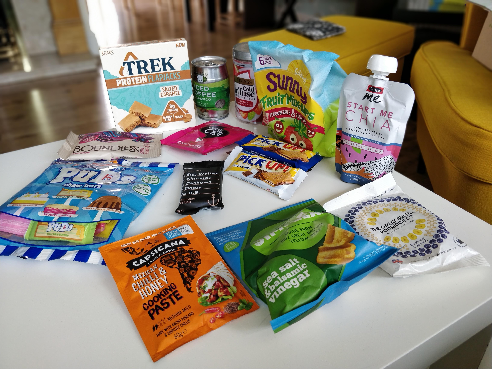

The August Box arrived and we were not there to pick up. Shout out to Alan who put in our house as we were away. 

Harvy
----
Feeling a bit lighter than other boxes, so was just expecting no drinks but suprise! Iced coffee. To be honest I'm not that excited with this one, between the chai tea and chai breakfast blend going to the puds sweets, there's not much inspiration here.

##### Swizzels Puds

Harvy - I didn't feel that these wanted production, I've had a lot of chewy streets and especially refreshers which this comes very close to. The different flavours were a mixed bag. Sticky toffee I think didn't work out well and the rest were palatable. Probably won't buy.

Tina - Imagine a colourful blob made almost entirely of sugar with an artificial hint of a flavour of some popular desserts. There you go. You never get all of the slowly melting stuff out of your teeth again. But it is so sweet, do you really want to? (Not recommended by 100/10 dentists)

##### Boundless

Harvy - The only thing I remember from this is the hit of chilli after you finish the nuts. I'm not sure why this is a thing.

##### Simpleas

Harvy - Tina didn't want it as it had vinegar. The pea taste for me was just overpowered by the salt and vineger and texture was just like eating mush. Not a fan. 

##### Capsicana - cooking paste

Tina - We tried a variety of the added recipe and it was rather nice. A different taste to the usual cooking pastes. Not too spicy and tastes almost naturally. Intense smell during cooking. Would buy again.

Harvy - I only tasted the end result but I was impressed, would also buy and then make Tina cook with again.

##### Sunny fruit mix up

No comments, I guess it was just meh then.

##### Pickup

Tina - I know them from other countries, and they are a nice snack. Had the hazelnut one which had soft chocolate in the middle. Looking forward to the white and milk chocolate versions too. 

##### Iced Coffee

##### Cold Infused "Tea"

##### Yet another Chai Latte

##### Protein Bar

##### Porridge
Tina - Good but how bad can porridge be?

##### Start me Chia