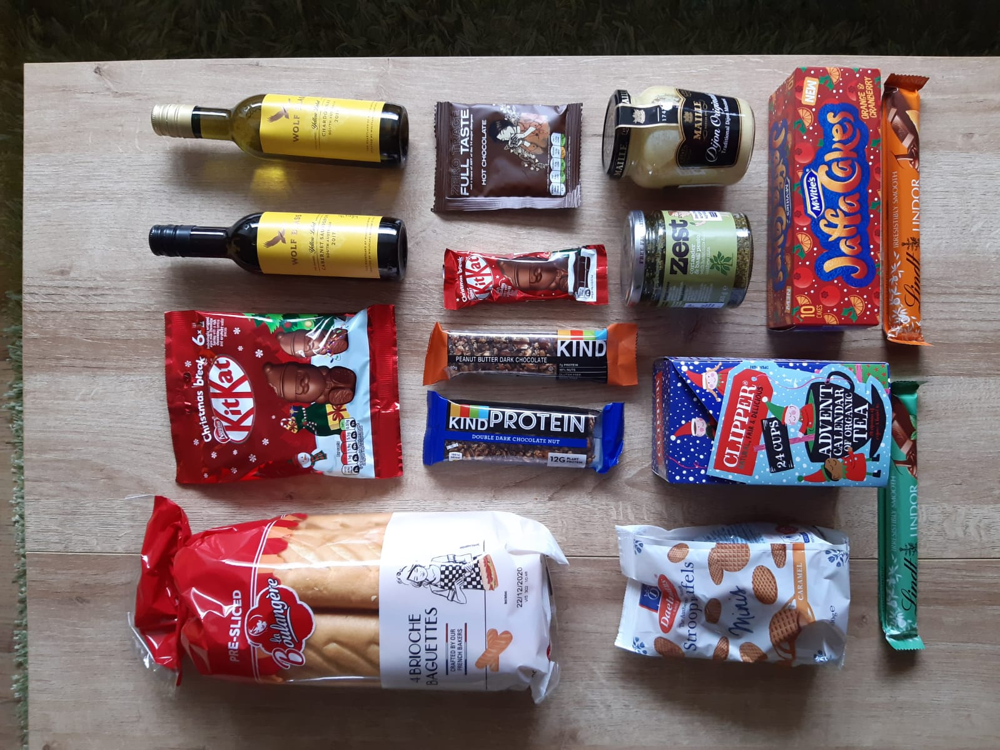

A surprisingly warm november

##### Brioche Baguettes
Tina - We made them into oven baguettes and they were surprisingly tasty. 

##### Kitkat Christmas
Tina - There was one big one and a bag with much smaller ones. The big ones was a good portion, the smaller one, same taste but really tiny. 

##### Wolf Wine
Tina - Cute little bottles, average taste of chardonnay and cabernet, as far as my uncultured pallet can judge this

##### Hot chocolate
Harvy - I think I remember having this but it seems to be just all the other instant hot chocoate out there.

##### Protein bars
Tina - Nice and nutty without getting too dry and crumbly.

##### Stroop waffles
Tina - Stroop waffles can’t be bad! EVER!
Harvy - Agreed. 

##### Advent Tea
Tina - Threw it out after many months and several tries as they were all super fruity and weird. Just not my cup of tea.

##### Lindt
Tina - Rather delicious, both the mint and the orange. 
Harvy - Had them before, so nothing surprising here. Still very good.

##### Orange and Cranberry Jaffa cakes
Tina - Quite nice and juicy. 

##### Dijon Mustard
Tina - It’s mustard. Nicely strong but we had already mustard at home, and how many open mustard jars do you really need. 

##### Coriander and basil pesto
Tina - Not tested it yet.

