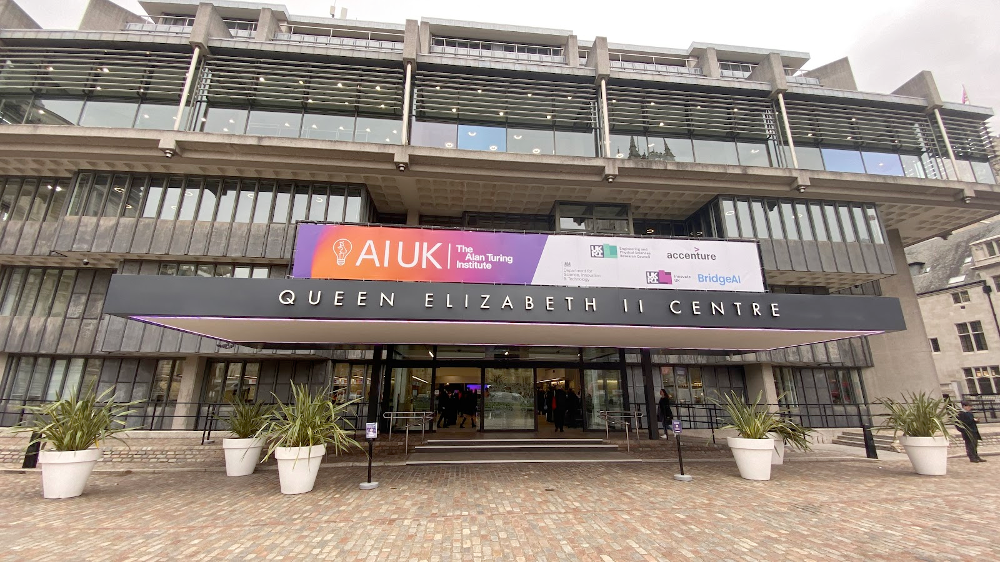
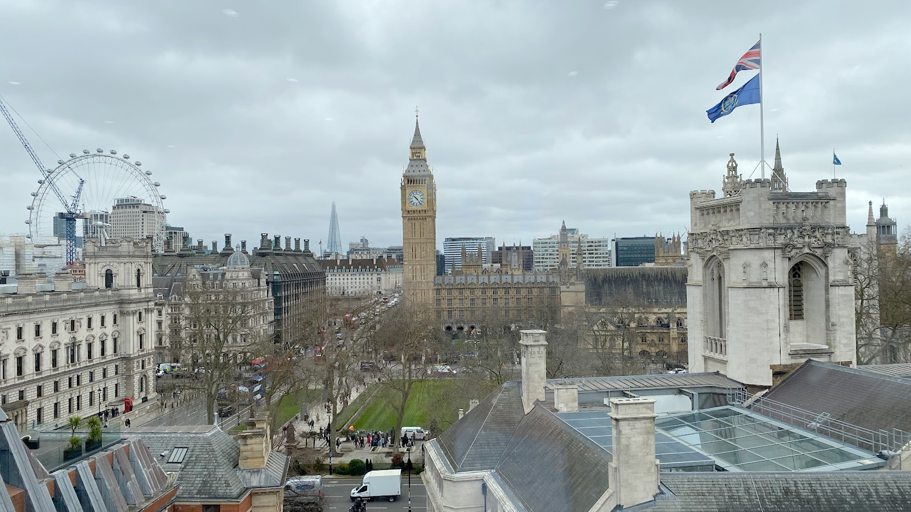
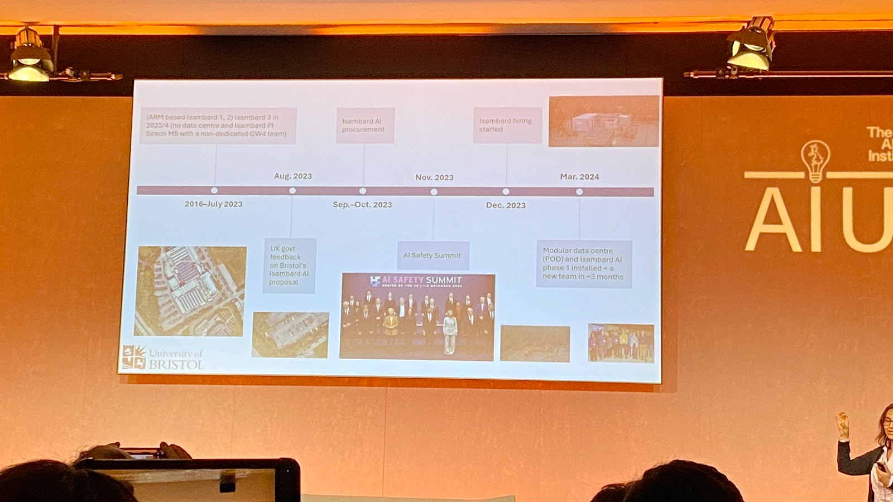
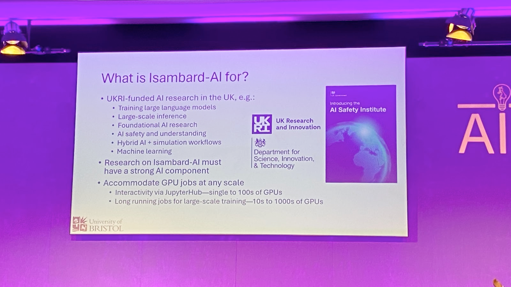
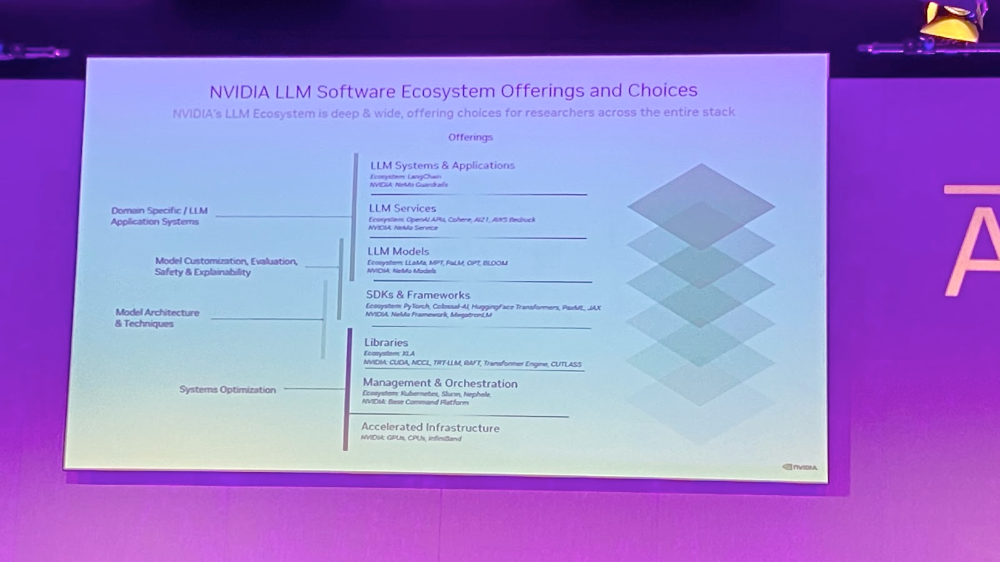
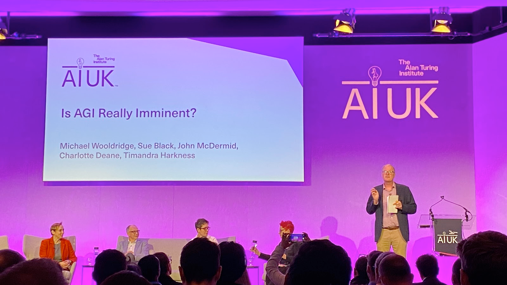
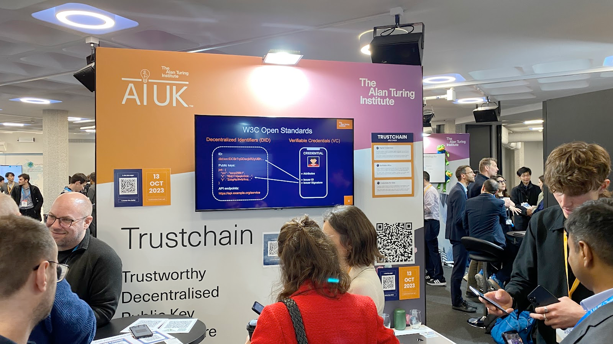
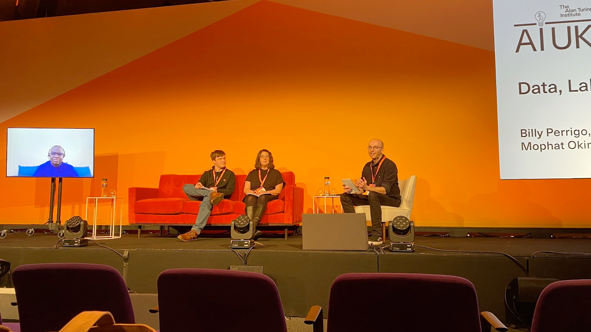
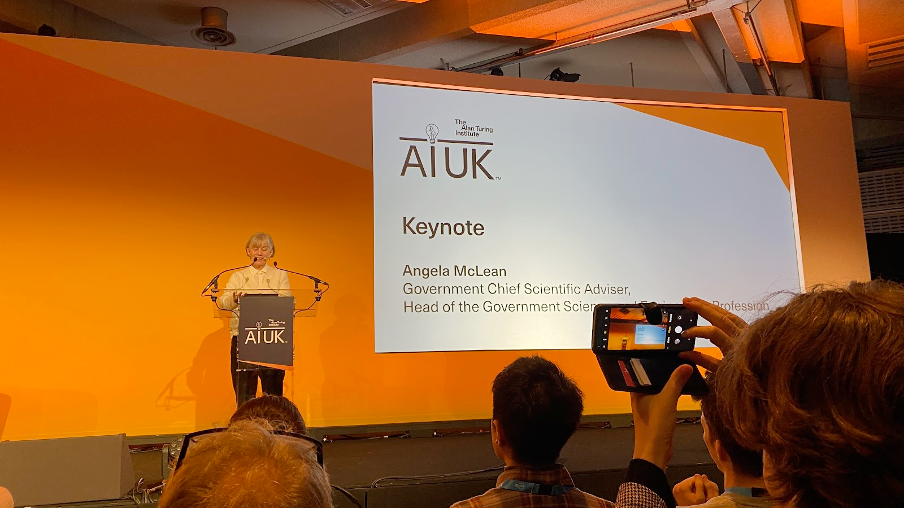

# Registration

Good morning everyone and welcome to AIUK 2024.

# A Sneak Peek Inside Isambard-AI
`19th March 09:20`

First talk is up on one of the most powerful supercomputers built in the UK

Outline - How did it start?  
Part of the Uk’s national AI research resource  
Built on ARM processors  
UX is a key measure of success  
Sustainable, accessible,
It is part of [£300 million to launch first phase of new AI Research Resource – UKRI](https://www.ukri.org/news/300-million-to-launch-first-phase-of-new-ai-research-resource/)

Building work is still underway.  
Very optimised for Power usage effectiveness  

**What is this supercomputer for?**

Each blade has 900GBs+ of high bandwidth memory 🤯

All these layers will be available to use 

It will have guardrails for LLMs to stay within boundaries, eliminate bias and lower toxicity.

On to UX?  
SSO and MFA.. ok  
So it’s just AI as a service  
Flexible Consumption rates… so Ai as a service  

Phase 1 is already here and it’s being tested.

Great to see the UK investing in AI supercomputers not owned by BigTech. Reference to [The Bletchley Declaration by Countries Attending the AI Safety Summit, 1-2 November 2023 - GOV.UK](https://www.gov.uk/government/publications/ai-safety-summit-2023-the-bletchley-declaration/the-bletchley-declaration-by-countries-attending-the-ai-safety-summit-1-2-november-2023)

Questions **how do you get user requirements?** Is it just build it and they will come?  
Requirements came from a report and it will be iterated on.

# Is AGI imminent?
`11:05`  
No. Thanks for coming to my Ted talk.

**What is AGI?**
Ai is a mirror on ourselves.
Differentiate between AGI and artificial super intelligence.
Why are we pursuing AGI as a replication of humans when we should be using them to do the things we don’t/can’t do?

**Is the physical world part of AGI?** But robotic AI is behind.
Could be misleading to think AGI would be fair in education, welfare.

Bias analysis of GPT2 shows a lot of bias due to the datasets involved.
“LLM is an improv comedy group” 😂
The bar will keep moving on AI and what good looks like.

Audience Poll: **does AGI need to interact with the physical world?** Answer is no. Approx 300 people
AI Completeness - if you could solve an AI hard problem then a lot of others are also solved.
Maybe not as data comes in different forms and will be broken down in a different way.

Causality is another issue to look into for AI.

People are using chatGPT as an advanced search and don’t see past that.

**AGI in the world of work**
Expect low level video/content creation will go.
Constant retraining. Jobs will only be available to seniors, polarising juniors.
Ability to write legal documents could go, where it’s a highly skilled profession and they could disappear.
A symbiotic relationship between AGI to do jobs in a different way. People will lose out to people who do use these AI tools.

**What does it mean for the UK?**
Public vs private sector. Private sector has massive resources compared to public sector. Even with Isembard
Optimistic and it will be an exciting ride even if the UK is not the biggest player and may not be.
This tech seems concentrated compared to the early days of the web.
US vs UK mindset on startups.
UK could lead on safety in AI. Data is more safe in the UK hands as opposed to private companies.

**Audience poll : are you optimistic on AI?** Yes.

Audience questions:
**Have LLMs peaked? do we need another breakthrough?**  
**Should we get insurance against AI models?** Staged insurance policies. It will be very different from what we have now.  
**Are we framing AGI in the wrong type of intelligence model i..e human?** Dishwasher AI  
**Why do we worry about not owning the tech in public sector AI?** Distinction between foundation and frontier models, concern we can’t put that much money in cutting edge models.

**Audience poll: AGI is imminent?** No.

# Lunch
`12:10`

# Stalls
`13:00`

# AI Culture Long table
`13:30`

Can AI generate something new?  
Can AI be good for art? Turning memories into a poem. Opening up access to an experience that wouldn’t normally be available.  
Making art is more important than the art itself, the effort of making it is important.  
Clicking a button may depersonalise it.  
Intentionality means that kinda makes it ok.  
AI art is the first autonomous tool but we do have examples of primitive tools that could be considered as autonomous.  
Lowering the barrier  
Who is the inspiration if you use AI to start creating art?  
We are terrified of but excited for a computer that can imagine beyond human thought.  
Unintended consequences of for example a 3 hour conversation with your mom compared to talking an LLM that’s trying to be concise.  
Co-designing is important going forward with AI art.  
Drag performances get a rise in economic downturns  

# Data, Labour and AI
`14:40`  
Strong start: it seems to be about the abuse of labour and knowledge for AI.  

First-hand experience for detoxifying GPT during its training stages.  
Knowledge was stolen from sites (we knew that).  
Same firm that detoxified chatGPT also worked in content moderation for FB. While some was done by AI, the rest was outsourced to third world countries.

We are looking at a global gig economy,  
There is a perception that tech workers are paid well but it’s hidden with low paid workers. Lot’s of low paid workers were used to help build chatGPT.

Gig economy has created back channels that has increased solidarity and could lead to unionisation.
AI workers or gig workers should have the same protections as perm employees even though they should do.

During training/content moderation they were not told about the work they were about to do, so can be quite jarring and can have side effects. Instead of manual labour being exploited it’s people's mental health.

There won’t be an AI revolution unless workers embrace it. Our restructuring is dependent on 3rd world country workers to do some of the work. We need to choose what work looks like for all of us, globally.

Equity is not for the benefit of the employee. It’s for executives to get more productivity from workers. How workers get paid globally is a choice.
Lack of knowledge about working in 3rd world countries means there is heavy exploitation. Got paid 75cents an hour for training chatGPT compared to what it is worth now. Workers are now asking if this work is dignified.

We are creating global experts.  
A different model is emerging where datasets can be resold for training multiple times and that can be used to pay workers more for AI works in 3rd world countries.

Audience questions: **hidden labour, how is hiding it?**
Employees have to sign NDAs and the company didn’t disclose their clients. Work is siloed and crowdsourced.Essentially it’s built into the system.
You can tell where the work is being done based on what is being paid.

**How is AI exploitation new compared to other manual labour like mining?**
It’s not new but it’s like care work. Stuff is curated.
What is new is how the public sees it, we think tech is cushy. How bad can it be to look at a computer all day?
Government in Kenya has opened the borders to digital labour without regulation.

Algorithmic management needs to be able to be questioned.

**What does solidarity look like across the global south?**
Unions in the south are connecting with each other. 

# Keynote
`16:00`
Angela McLean, Government Chief Scientific advisor.

We need a scientific and systems approach to AI.
Systems approach: AI superpower in 2030

5 critical technologies
AI,
Semiconductors,
Quantum,
Something something

This framework is a way to go across government departments and unify.

**R&D investment update UK**  
UK in a good place to be a science superpower.  
£100 million into the Turing institute from UKGov.  
We know we need more compute to bring AI into UK funded research programmes.

70 experts in government to invest in building AI.  
Understand the benefits of AI and the harms.

**Scientific approach to AI**  
Transparent, Rigour, Reproducibility. Seems obvious but people don’t do it.

Her department has consulted a lot of people.  
Pretty optimistic view on AI with a plan.

Questions:
**What were the takeaways from the AI safety summit?**  
Current set of architectures is not safe. Building a framework to make it safe.

**Where does the public voice fit here?**  
Looking at a consulting opp but they don’t know. Missing value in number polls, analysis of free text answers is now possible.

**How are you advising the higher ups?**  
Believe their role is to amplify other scientific advisors. Be optimistic about science

**Are you confident we have the talent to be an AI superpower?**  
Yes. We are building capability already. Big investments in compute to attract talent. There are visa systems in place.

**How do we study the environmental impact?**  
Gather data of our energy use and how it is made. While big it could pale in comparison.

**How much is bias on your radar in AI (and in government)?**  
We know it’s a massive issue. Talked a lot about what you can and can’t do around bias. Make it visible.

**Final message**  
Be hopeful and it’s exciting. It’s about information on people’s lives and it will help. It’s a once in a generation opportunity.
