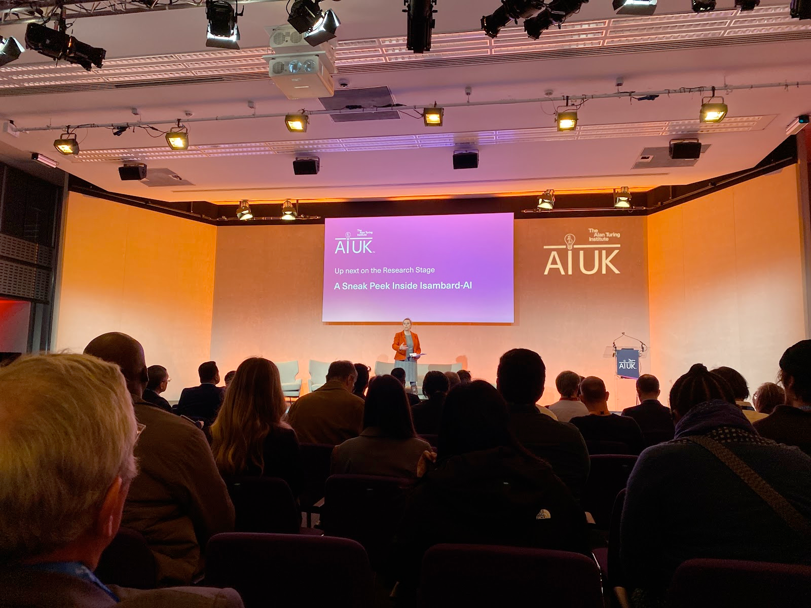

# Registration

Good morning everyone and welcome to AIUK 2024.

# A Sneak Peek Inside Isambard-AI
`19th March 09:20`

First talk is up on one of the most powerful supercomputers built in the UK

Outline - How did it start?  
Part of the Uk’s national AI research resource  
Built on ARM processors  
UX is a key measure of success  
Sustainable, accessible,
It is part of [£300 million to launch first phase of new AI Research Resource – UKRI](https://www.ukri.org/news/300-million-to-launch-first-phase-of-new-ai-research-resource/)

