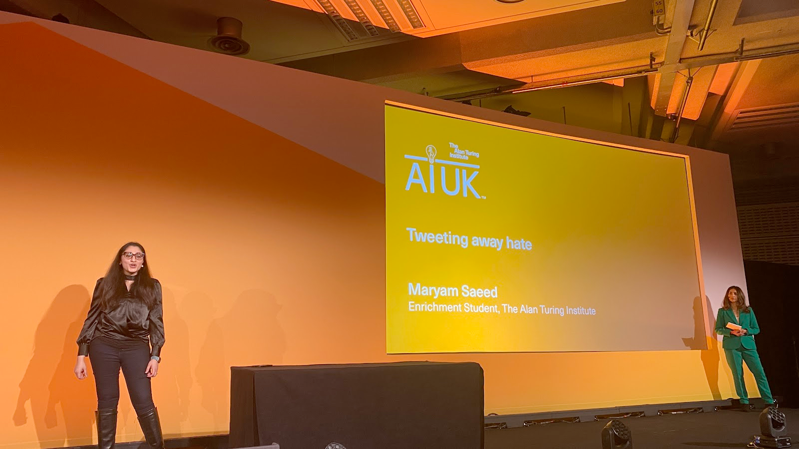
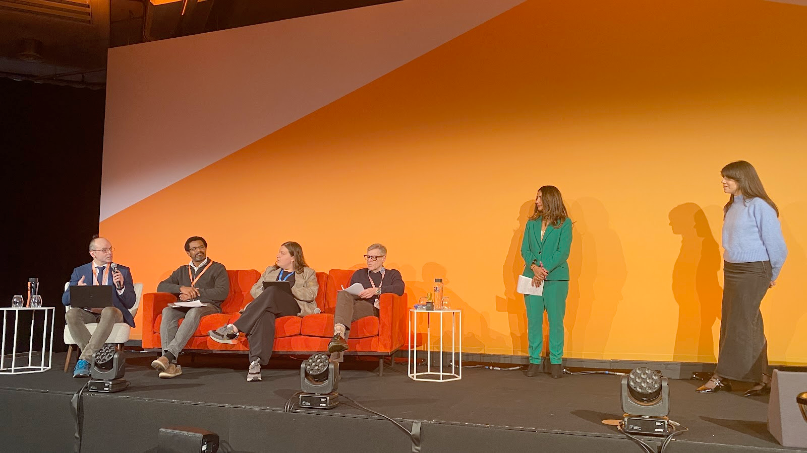
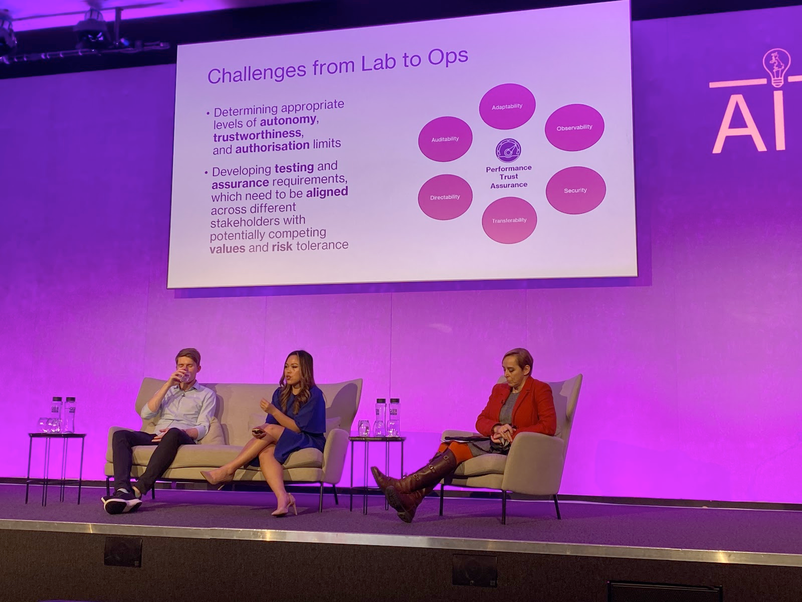

# Late start

Back again for Day 2, right next to the glorious Westminster Abbey

# PitchFest
`20th March 10:00`  

Researchers (enrichment students) have 90 seconds to pitch their projects and highlighting its real-world impacts, creativity and innovation. They will be judged.  
We are really trying to get the crowd excited but it’s a tough morning  

**Pitches**
* A wearable robot tail to support lifting tasks, using AI reinforcement learning to adapt to the body
* Using language models to write code without errors generate code, explains what is wrong, fix the errors
* What’s in the box? - XAI describing what rules determine AI models, highlighting auditability and traceability
* **WINNER**: Why facts don’t change minds - belief networks reinforce bad ideas. Use NLP to work out the underlying structure of the belief network to show how irrational beliefs can have rational origins [Trisevgeni Papakonstantinou](https://ai-uk.turing.ac.uk/speakers/trisevgeni-papakonstantinou/)
* Tweeting away hate - how to respond to hate on social media
* Volcano defence - slow and manual to check rock crystals using AI to analyse 

# Stalls
`11:00`  

# Autonomous Cyber Defense
`14:35`  

What happens when cyberattacks exceed the capacity for humans to respond?
Deep Reinforcement Learning is the major tool for cyber security.  
[CAGE challenge](https://github.com/cage-challenge)

It’s been mainly simulated and not rolled out to real systems or constrained problem space.  
This particular lab is looking to find real attackers on real systems. Having more complex agents.  
Using AI to find vulnerabilities in systems before humans do.  
[Purple Llama](https://llama.meta.com/purple-llama/)  
[AIxCC](https://aicyberchallenge.com/)

How do humans oversee a system that runs faster than them?  
How can we stop them being used against us?

Lots of questions around policy issues

Questions:
**How do you counteract bad actors?**
It’s already an arms race

Good to use lots of small models instead of a generalised model.

**DRT how have you defined a reward function in cyber defence?**
Less concerned about reward and more on real world systems as opposed to simulated. Easy to emulate lots of issues in a simulated env. 

# AI and the battlefield of the future
`15:00`  

Military is looking at AI and it crosses every aspect.  
Only 40% of mil are available for deployment at any one time.  
Lots of mil assets ready to be deployed but just waiting and need lot’s of maintenance. Could be an AI problem  
AI Logistics - interoperability is tough. Buying the right tech is hard.  
Weapons review process for new weapons on the ethics of use.  

# Digital Twins for the Environment
`15:30`

Digital replica of a system for forecasting. Difference between that and a simulator? Digital twin can be used by many users and can be continuously updated.  
Most people believe that you need AI to create a digital twin. It needs real time infusion of data, be accessible to all types of users, highly complex.  
Optimising observing systems.  

Digital twin is the intersection of modelling and monitoring. As a specialised user you can use a digital twin without having the expertise of various systems/disciplines  

Oceanographic institute made a model of a protected area.  
NASA is looking at many prototypes for coastal zones, wildfires. It is also support projects in symbolic AI as they fit the problem space nicely.  

NASA is still investing in the infra needed for earth science and AI.  

**Challenges**  
How do we communicate these complex ideas to people? We need to find tools to visualise these ideas to decision makers.  
We would like to use digital twins to predict extreme events.  
Big uncertainty in digital AI systems.  

Interoperability should be a requirement for digital twins.  

**Questions**  
We want to be confident about a problem we don’t know about.  
We can expect users to be reasonably smart around uncertainty i.e. weather forecasts how do we make users act the same way with digital twins.  
Twins are realtime and hard to use with AI or really simple but can run 1000x realtime  
Skills to be in a digital twin team needs to be multidisciplinary. Social science, health, hard sciences, essentially mirroring the class of users.  
Call out to AI people to solve environmental systems.  
Components can be built for digital twins.  
