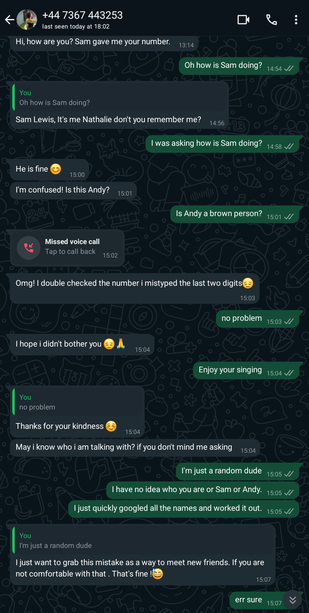
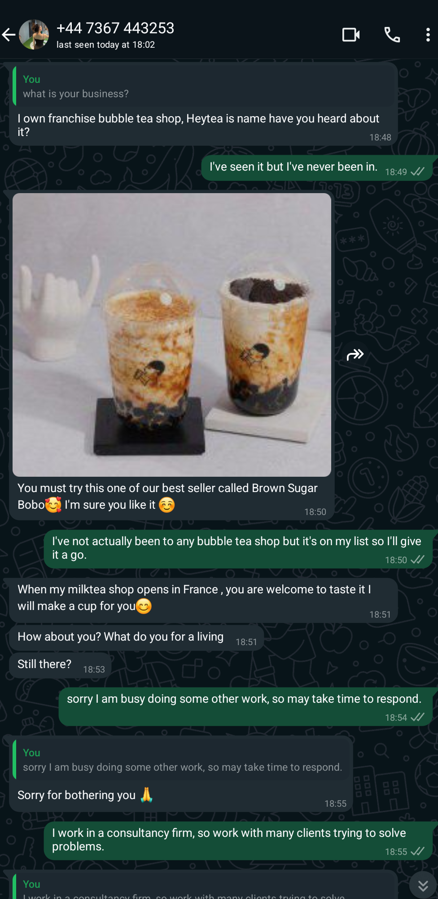
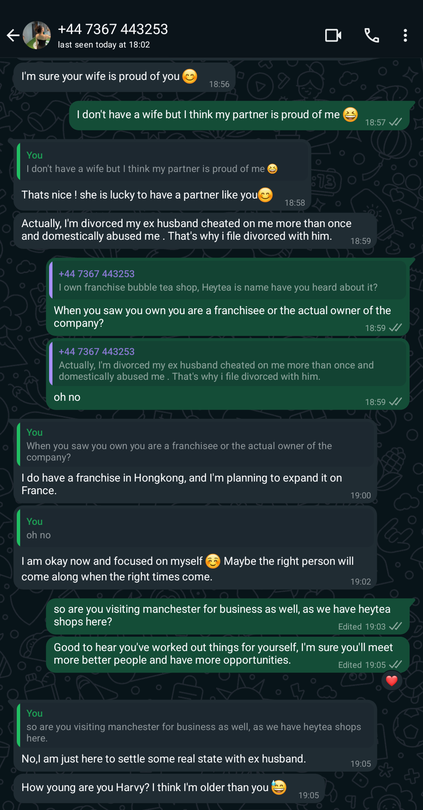
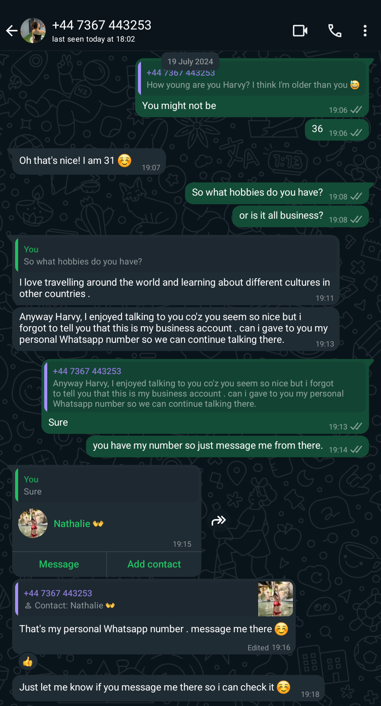
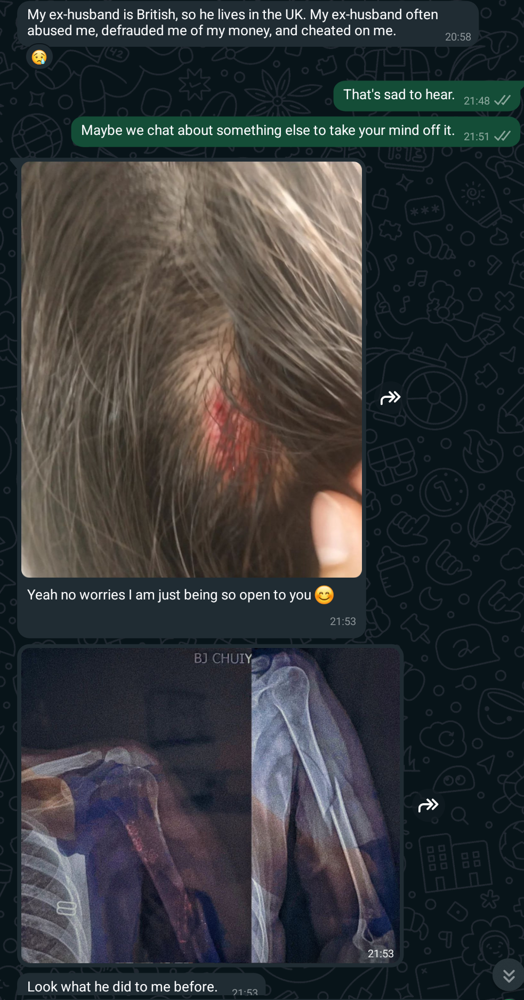
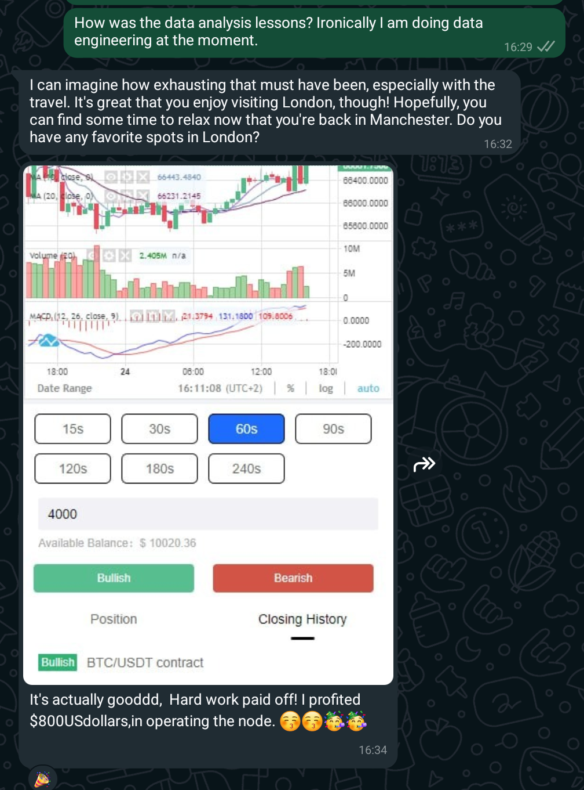
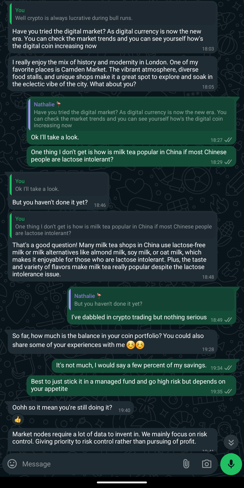
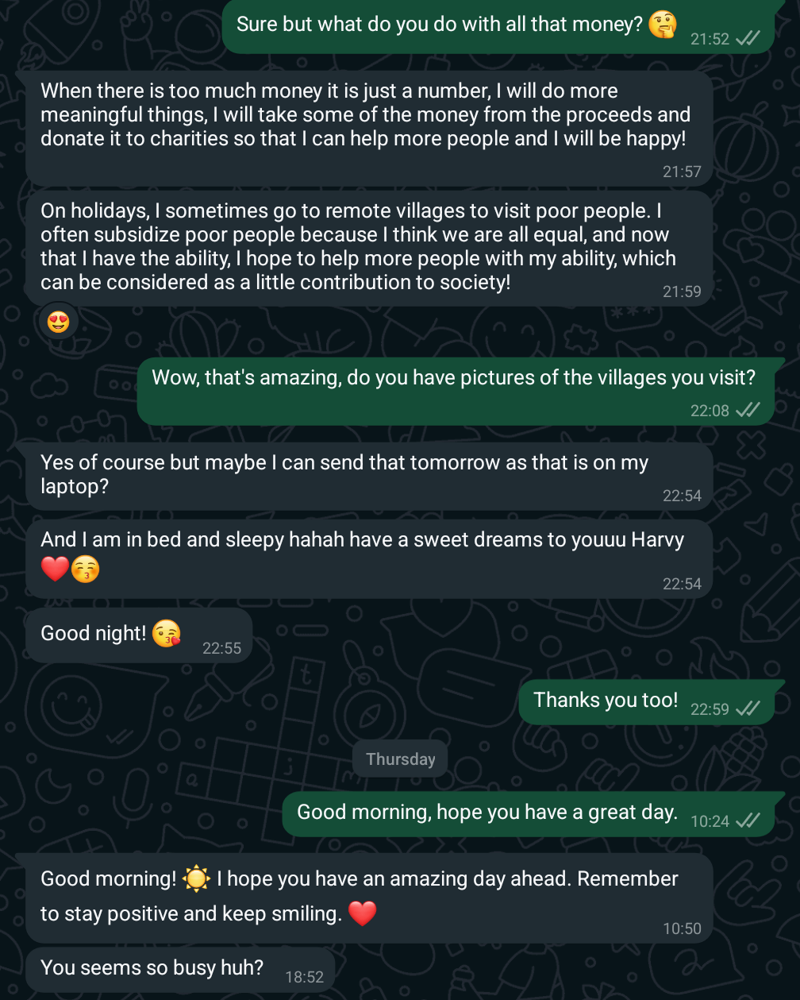
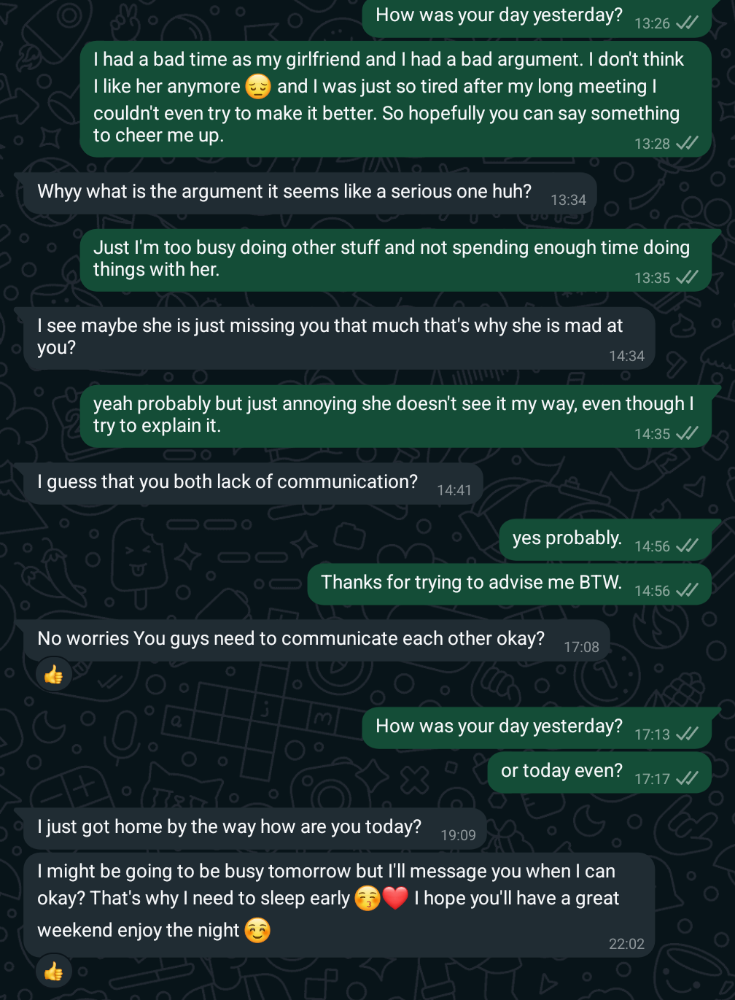
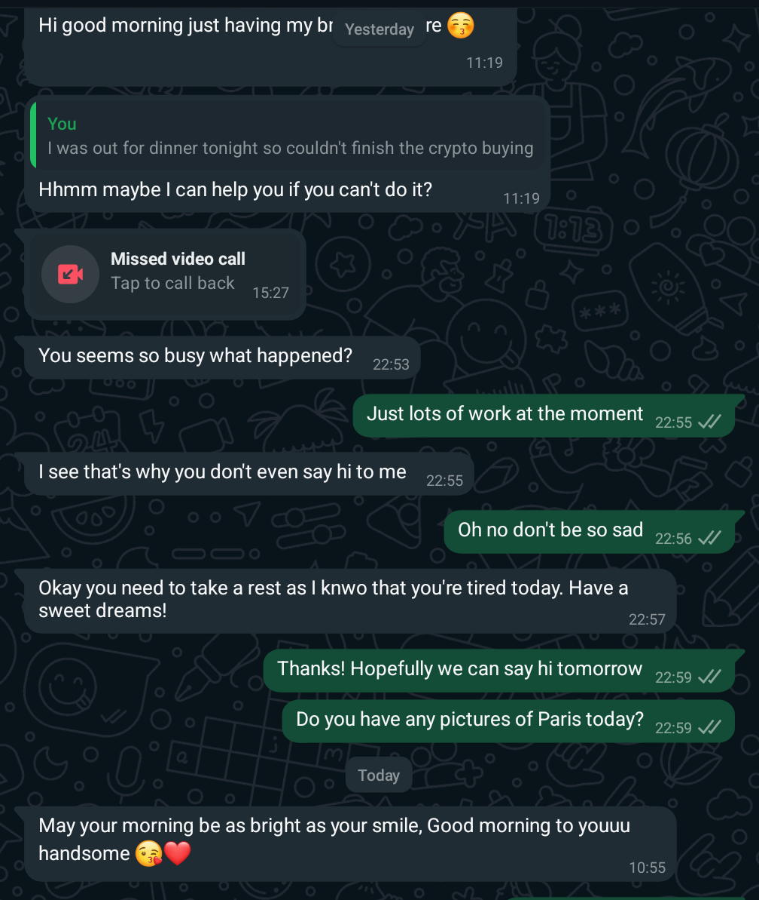

# Safety

First up: DO NOT ATTEMPT TO DO THIS.

but it was good fun though. 😈

This post seems to contain sensitive information or PII, but it's all false.

There are also a few images of a medical injuries.

### Let's begin

It started innocently enough. A kind lady named Nathalie accidently texted the wrong number. I get these all the time and treat them like a scam, so I just run along with it and see what happens. Generally just try to waste their time but as you see I could potentially do a lot more damage.

[{: width="500"}](initial_content.png)

It follows a certain trope of a genuine mistake but trying to make an opportunity out of it.
Ok sure lets see what happens. Some nice pleasantries are exchanged. Also they send a photo of "themselves", an attractive young asian woman.

[{: width="500"}](1_business.png)

She explains she is an owner of a heytea franchise (chinese milk tea chain) and tries to be even more inviting.
The aim here is just introduce casual conversation and work out their target.

[{: width="500"}](2_collecting_the_mark.png)

At this point they are working out if they can try a romance scam. I shut that angle down. They also check my age, I guess to see how much money I could have or maybe they have some morals around the young or elderly.

### The handoff

[{: width="500"}](3_switch_up.png)

Then they need to switch up as this is a business phone.
This seems to be a triage system where they hand over to another person to carry on with the scam.

[{: width="500"}](4_injury.png)

On the new number and immediately get a sad story of abuse and even some disturbing images. At this point I know something is up and try to look for the name in the x-rays and research who this woman is. I find a facebook page and instagram, so there is some credibility but the facebook page was created a month before and then soon after it was made private.

[{: width="500"}](5_france.png)

I then follow up to see what they can say about their trip to France. They post a picture which doesn't appear in search engines. Some conversation here but the continuity is lacking. No mention of the tourist attraction I recommended ever comes up again.

[{: width="500"}](6_meeting.png)

I then surprisingly get a video of a meeting, which seems pretty strange but fits the narrative where this person was learning some financial training as part of being a franchisee? or something. 

### The turning point

[{: width="500"}](7_app.png)

I then ask about that training but then get a screenshot of some app or website that doesn't seem to be real. There are no images that match the app and the screenshot doesn't look like it's taken on a phone screen.

[{: width="500"}](8_chatgpt.png)
[{: width="500"}](8a_actual_chatgpt.png)

This was another red flag. The language seems to switch between a person giving responses and then a chatgpt response. I do a comparison between the two and they are eerily similiar.

[{: width="500"}](9_altruistic.png)

So I explore more on their motives and surprise, they are an altruistic rich lady. They even go to villages and just give away money, I'm sure that imagery won't portray colonialist overtones.

I never got the pictures by the way.

[{: width="500"}](10_paris.png)

I even get pictures of Paris during the olympics, so they are sticking to the narrative and these are obviously recent pictures. I reverse image search these and nothing comes up. It could be they are actually there? I think the problem here is a lot of these images could be behind a social media login wall and probably can't be scraped.

[{: width="500"}](11_crypto.png)

I then get a strange pivot to the British economy and it's now bankrupt. Oh noes! I should invest in Tether coin. Well I mean if it's that bad I guess I should try it out.
At this point they should be worried that I'm even entertaining it at this point. I report the last few messages to whatsapp but they are not blocked.

At this point there are many red flags.

Let's go through them:
* Change in conversational style and tone
* Inconsistant flow of thought, just straight up ignoring messages and repeating questions. No reference back to the points they bring up
* These pictures are either of themselves or just stock. Sending a picture straight off the bat with a stranger
* Screenshots of an app that doesn't seem to exist
* Seems to know a lot about crypto but not about other aspects of their life

Also for the record at this point they know my nickname, phone number, which city I live and that's it. They've got no pictures or other identifying information. They voice and video call me but I don't answer.

Then I talk to a friend about this and learn about the pig butcher scam.

### The pig butcher scam

Jackpot! So [The pig butcher scam](https://www.investopedia.com/pig-butchering-scams-8605501) works with the analogy that you fatten the target up by using a combination of the romance and investment scam. The target gains trust by seeing the returns on their investment until you do a rug pull. At this point the target could've "invested" £10,000+

There's a [great podcast on this](https://darknetdiaries.com/episode/141/). 

Now I know what it is and how it works, what to do next? Well make money of course ;-)
Can I just reiterate? DO NOT ATTEMPT TO DO THIS. DO NOT ATTEMPT TO SCAM A SCAMMER.

So they need to show that people can invest and even get money out to gain trust, so with that in mind how much can I get out of them? More on that later.

I test out the theory and lean into the baiting.

[{: width="500"}](12_relationships.png)

So just to see if they would take the bait of turning it into a love scam, I claim that I have a big argument with my girlfriend but they actually try to give me advice. Oh well worth a shot.

[{: width="500"}](13_ghost.png)

I ghost them for a bit to see how they respond, they try a bit of passive-aggressive and I agree to buy some USDT (Tether coin). They want me to buy $100 but I say I'm only going to buy $10.

Data for search engines

Nathalie Chen
+44 7367 443253 - triage scammer
+44 7453 486329 - pig butcher