# Advances in Data Science and AI conference at University of Manchester
`9 Jun 2025 09:12`

Well this is a bit of a weird one. I’m now back in my alma mata (as the americans say) at a conference on AI that is now hosted by the head of the Institute for Data Science and Artificial Intelligence who used to be my old tutor on my actual AI undergrad course.

Anyway this is a 2 day conference, I’m only here for one due to client commitments. Programme is here: 

[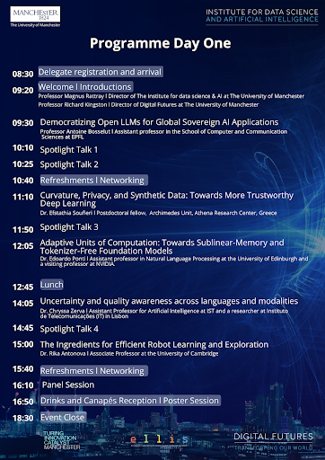](programme.png)

Usual swag but why are they including a power bank still!?!? Probably gonna return that.
[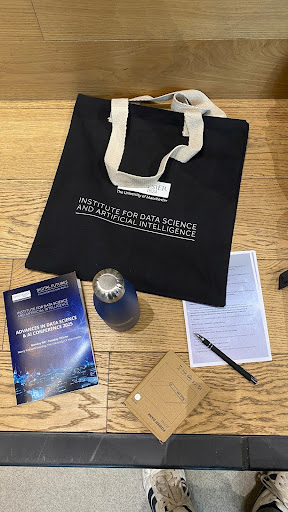](swag.png)

`9 Jun 2025 09:27`
# Sovereign AI, aim is the model to match the regulations and culture of the target region
[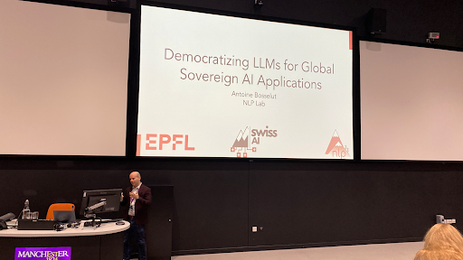](sovereign.png)

Talking about concern on AI development in regard to regulation. 

Talk covered: complying with companies request to opt-out. Dealing with multiple languages.
[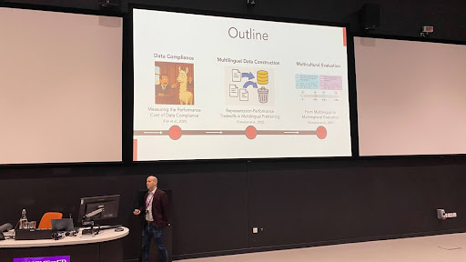](outline.png)

Switzerland as an example. 4 official languages, 750 NGOs, 46 International Orgs. Infrastructure set up in hardware and community is ready to go.
Swiss AI lab to globalise LLMs for sovereign change. 
Now going into technical details… i.e. robots.txt to demonstrate a backlash against AI crawlers. Findings show that 8% of data will be removed as part of opting out compared to 5 years ago. Data compliance gap has almost no impact on general knowledge understanding (this was normalised across comparative data sets).
[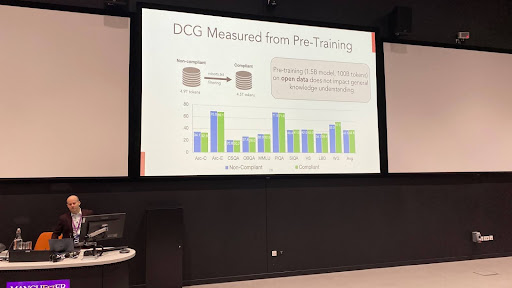](dcg.png)

Using DCG to measure performance loss has shown at the mid-training gap there is a bigger performance drop.

Next up: how to handle multiple languages. Basically we still filter it out unless it's a “high” resource.The two biggest and worst inputs for multi language training… The bible… and adverts. Swiss AI lab managed to get a 3.2% gain on low resource languages. English wasn’t affected by using multilingual representation.

Hey they’re hiring!

Now on to cultural and global knowledge affecting language. Multilingual benchmarks translated into English showed Western bias 🙄 I guess they had to prove it.

Also they’re hiring!

Q&A
Language has shown to have biological backgrounds and AI model builders have decided up themselves to work out how languages works.

`9 Jun 2025 10:14`

# Spotlight talks
[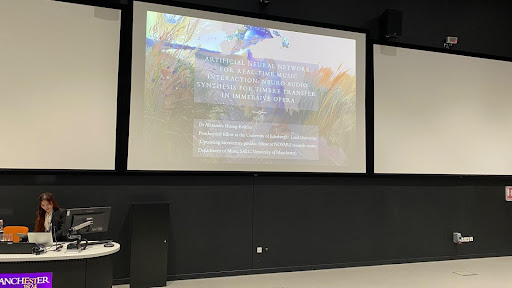](spotlight-1.png)

First talk by an opera director.
https://alexandrahuangkokina.com/operai/

An interactive opera using plot branching…. Hmm not really AI though.
Now talking about how to translate music for one set of trio (piano, violin and cello) to Koto, Hichiriki and Sho.Shifting timbre from one set of instruments to another.
https://neutone.ai/

Next up : Graph domain adaptation 😵‍💫 I’m gonna try and dumb this down.
Nope, I’m out.

[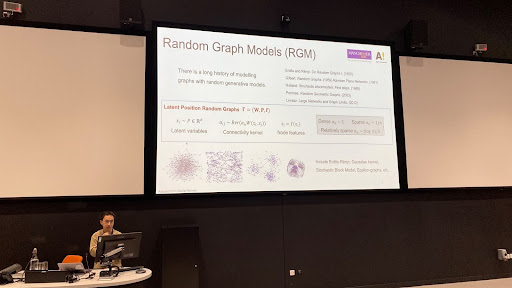](spotlight-2.png)

`9 Jun 2025 10:50` 
# BREAK

`9 Jun 2025 11:14`

# Using synthetic data with privacy guarantees.

GAN-based approaches that produce synthetic data produce visually similar outputs, therefore risk leaking inputs.

Epsilon and delta set controls on size. ← need to look up what they are.

DP-ImgSyn: Public dataset - Extracts batch norm states from private training data. Then matches the synthetic images with those norms. 
[DP-ImgSyn: Dataset Alignment for Obfuscated, Differentially Private Image Synthesis | OpenReview](https://openreview.net/forum?id=ZHAtvJtJnR)

Essentially you can create synthetic data (in this case images) that look similar but don't leak the original data and they’ve proved it.

And they are still proving it.
[[2402.18726] Unveiling Privacy, Memorization, and Input Curvature Links](https://arxiv.org/abs/2402.18726#:~:text=Recent%20research%20has%20shown%20empirical,than%20calculating%20the%20memorization%20score.)
[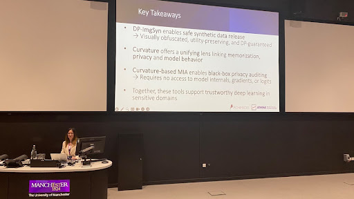](key-takeaways.png)

Q&A: How can this be extended out from images?
They don’t know.

`9 Jun 2025 11:46`

# Spotlight: Ball based Linear Regression
[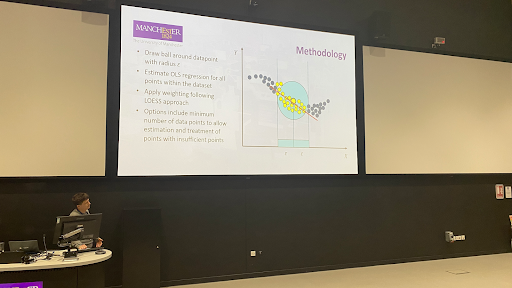](ball-based.png)

So this is an alternative to KNN clustering techniques.

You can have strange data results and regression or kNN isn’t good enough at picking out that weirdness. 

Ball based is simple to show but offers a better coefficient fit?
Hmm question time and it seems if you have multiple balls then past the training data it just assigns the next set of values to the nearest ball and radius… sounds like kNN to me?!?!?

`9 Jun 2025 12:00`
# Tokeniser Free Foundation Models
[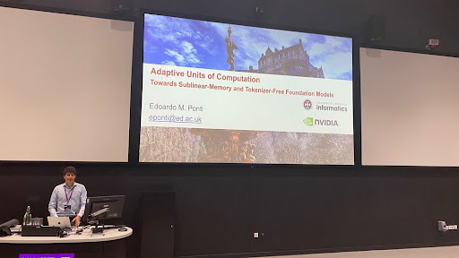](adaptive.png)

Old NLP is dead, apart from the tokeniser. 
Tokeniser are brittle, due to language constraints. Granularity is fixed. I.e. the tokens.

[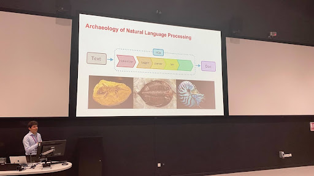](nlp.png)

[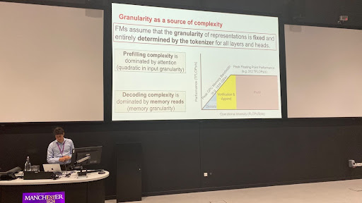](complexity.png)

Removing the tokeniser can remove the bottlenecks.

Hmm just switched to sustainability by making adaptive tokenisers to fix granularity. 

[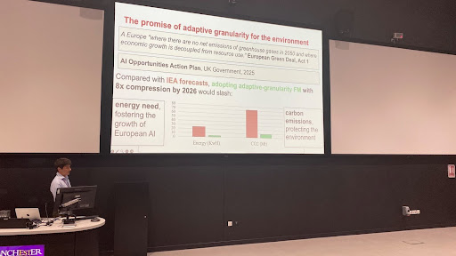](granularity.png)

Now going into the detail of memory inefficiencies and how to solve them. 
This can be retro fitted to existing LLMs instead of training them from scratch. This has been benchmarked on llama 2 with a range of scales.
Something like 16x compression on memory usage on a 70b model.
This then hits a compute bottleneck and is bound by that instead of memory. 

Ooooh even more interesting, can adaptive memory increase context windows? 
Degradation changes across models.

Inference time scaling = generate longer sequences or sequences in parallel. The assumption is compute budget is token speed. With compression this can improve that significantly. But only works if compressed memory is accurate.

The metric now has to be runtime using memory reads instead of token generation.

[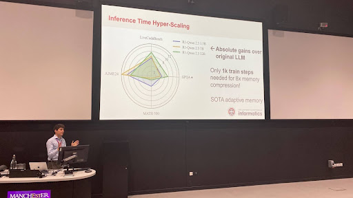](hyper-scaling.png)

Very good performance results.

Part 2: Removing the tokeniser.
Accept bytes as inputs

[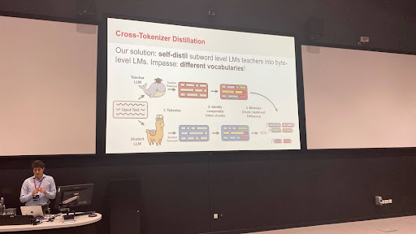](distilation.png)

Essentially have a teacher LLM that has tokenisation to teach the student LLM to adapt non-tokenised input. You can then do a zero shot method to swap out the tokeniser.

Tokenisers are a bottleneck we need to solve.

`9 Jun 2025 12:45`
# LUNCH

`9 Jun 2025 14:07` 
# GeoAI, last minute talk put in 
[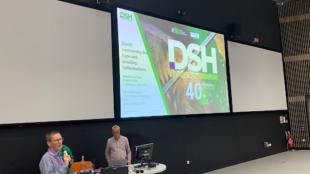](dsh.png)

Natural Environment Research Council

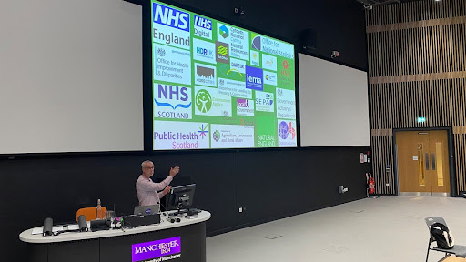

Accessing data held by environmental organisations in the UK. 

A lot of organisations want access to this data.
They focused on user engagement. 

GeoAI must be valid, data grounded and ecologically plausible.

Uses AI to help explore datasets where it’s semantically different but can be converted to generic user inputs.

How do we trust that data? 

Create a database of the metadata.Uses RAG combined with vector search engineer and a LLM.

Hmmm doesn’t seem like anything fancy here, it’s just trying to cite all the source of info but with accompanying SQL queries. 

Geospatial models should be available next year. 

Urghhh. Another Q&A and a guess on what the answer is. In this case, can you ask general high level questions and get a list of the datasets needed to answer the question? Only if it has been described in the data or relevant papers.

`9 Jun 2025 14:45`
# Spotlight talk: Predicting time, learning embeddings and generating synthetic cells from single cell gene-expression time courses

`9 Jun 2025 14:58`
# Talk to discuss new robot bodies

[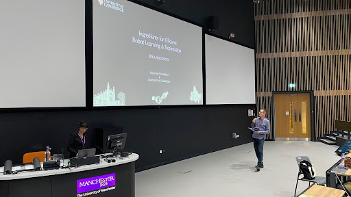](robot.png)

TidyBot - Robot can be given general rules, uses a onboard camera to detect and place objects. Benchmarked with 100 scenarios and 70 unique objects. 

[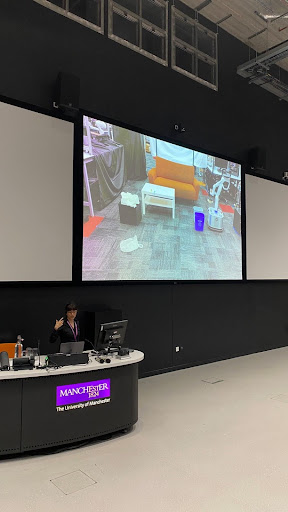](table.png)

It seems that physically scaling up an object is an issue for AI to perform the same operations, so we need equivariance. EquivAct can do it in zero shot.

We can demo a task to the AI and it can run the same or equivalent task, in some cases even without direct examples. It can even perform operations even when there are no examples.

It seems like you can just simulate the action needed and then optimise the movement

Low cost novel sensing solutions, so using magnets to work out sheer force.
[Stanford's new lab is developing robots to help with chores and medicine](https://youtu.be/Uzx1js2hOdY)

Lab is open to engage with industry in Stanford and Cambridge.

`9 Jun 2025 15:45`
# BREAK

`9 Jun 2025 16:00`
# Panel discussion

[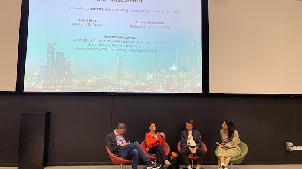](panel.png)

Richard Potter - Peak CEO,
Dr. Markella Mikkelsen - MolMart CEO,
Prof. Neil Lawrence - Deepmind Professor of Machine Learning Cambridge, Senior AI Fellow, Visiting prof of Machine Learning

“We deliver nothing in terms of what people want from AI in the UK at the moment.” “Universities care more about getting on front cover of Nature than the local newspaper.”

General introduction on why we need AI innovation in UK/Manchester. 

BIg issue with startups and the culture of investment risk in the UK.

AI ecosystem in Manchester currently valued at £3 billion. 

“Silicon valley has failed on the fundamental values that AI should be solving.” Silicon Valley has become a crutch to stop SMEs from growing here.

What we need is data, ML and AI could stop for now and we just need access to more data in the UK.

Interesting that most students are postering non-LLM projects and it’s traditional DS.

NHS improvement of just 10% would push it into a “surplus” operating cost.