# 🧠 Why I Built This

[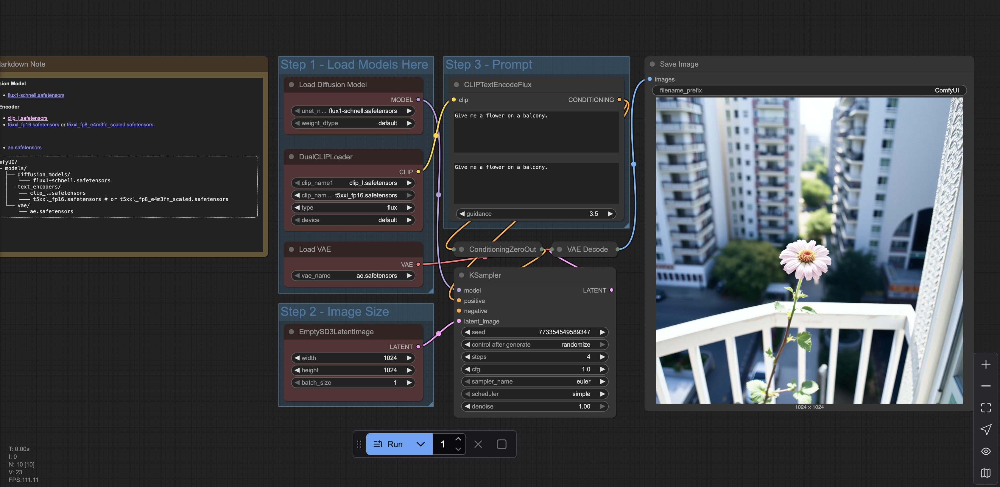{: width="700"}](comfyui.png)

So I decided to build my own AI server. Why? Well, a few reasons.
1. As part of de-googling and trying to host things away from big corp servers, this seems like the next step as we start using them more for AI services. Keeping data close to you, especially if you start talking to LLMs is worth it, IF you have the right security.
2. Cost-wise you can't beat the price for the larger models in the cloud (at the moment). But strangely you can do some things that are quite expensive for their cloud versions (see more below)
3. Plus, who doesn't love a good hardware project? 🤖

The goal was simple: build a powerful AI inference server that could handle local LLM serving, fine-tuning experiments, and general ML workloads without breaking the bank.

[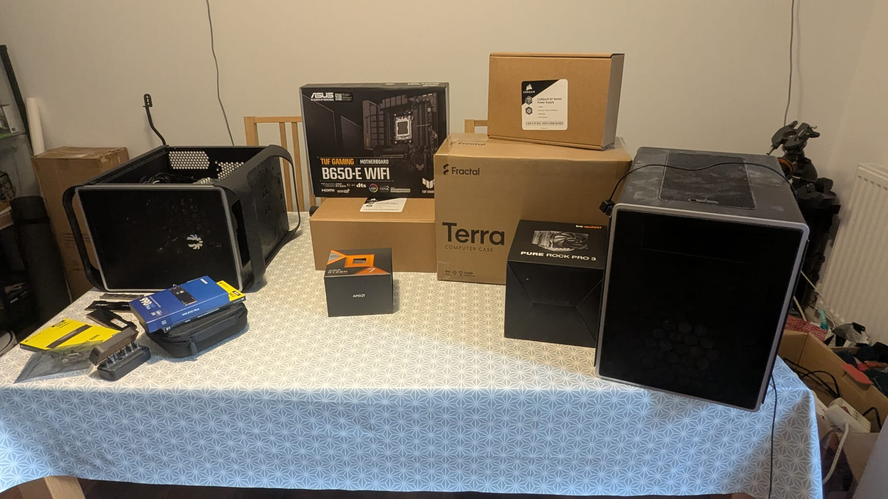{: width="500"}](server_parts.jpg)

## 🧩 Hardware Selection

After plenty of research and part swapping, here's the final configuration:

| Component | Model | Notes |
|------------|--------|-------|
| **Case** | Free case swap | Large, quiet, great airflow |
| **Motherboard** | ASUS TUF GAMING B650-E WIFI | PCIe 5.0 support, excellent VRMs |
| **CPU** | AMD Ryzen 7 7800X3D | Plenty of cores for mixed workloads |
| **GPU** | NVIDIA RTX 3090 | 24GB VRAM, CUDA and TensorRT support |
| **Memory** | 64GB DDR5 | Overkill? Maybe. Useful? Definitely. |
| **Storage** | 2TB NVMe SSD | OS + AI model storage |
| **PSU** | Corsair RM850x SHIFT | Side-mounted connectors made cable routing a pain in the butt |
| **Cooling** | BeQuiet Pure Rock Pro 3 | Keeps temps under control even during heavy inference |

Here's the completed build - a beautiful beast ready to run local AI workloads. The crowning jewel is that massive RTX 3090 with its 24GB of VRAM, which gives me enough headroom to run multiple models simultaneously.

As a note here: I wanted to make the rig as quiet as possible, as it would be in a second bedroom and office. If this is running 24/7 then would like to keep the thermals low along with the sound.

# The Build Process

## Day 1: Parts Arrival

I drove to Scan in Bolton to pick up the components rather than waiting for delivery. There's something about walking into a computer store and leaving with bags of hardware that online shopping just can't match.

<!-- Placeholder for unboxing image -->
<!-- [{: width="500"}](unboxing.jpg) -->

Everything arrived except the GPU, which was coming separately from an eBay purchase. The excitement of unboxing 64GB of DDR5 RAM and that multi-core Ryzen processor was real! However, I quickly realized I'd made a couple of mistakes in my ordering:

1. I'd ordered an ATX motherboard instead of microATX, which would make for a tighter fit than intended
2. The refurbished Corsair RM850x SHIFT power supply I'd purchased had side-mounted connectors, which I hadn't noticed in the listing - this would prove challenging for cable management later

The GPU was still on its way - a 3090 with 24GB VRAM that would not only power AI workloads but also serve as an excellent gaming GPU when needed.

## Assembly Day

I began by laying out all the components and preparing the motherboard. Installing the CPU and cooler was straightforward, though I was careful with the thermal paste application, which didn't go well as I had to remount the fans, as the RAM wouldn't fit in afterwards. It seems that is a common issues with the large heatsinks of the BeQuiet CPU cooler solution.

[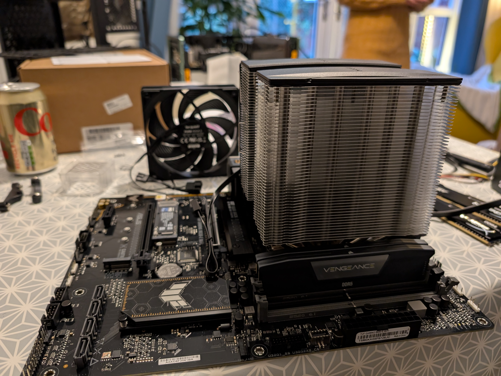{: width="500"}](motherboard_build.jpg)

After prepping the motherboard, it was time to mount it in the case. I was using a free case I already had, but it required transplanting all the components from another build to free it up. The extra work was worth it for the additional space and airflow.

[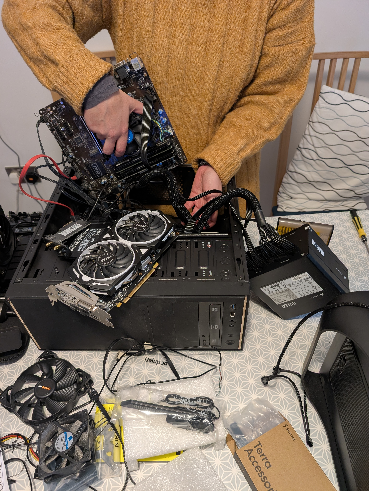{: width="500"}](motherboard_install.jpg)

The motherboard installation went smoothly, but the real challenge came with mounting the power supply. Due to the side-mounted connectors on the SHIFT PSU, I had to get creative and mount it upside down to be able to bend the cables down the side of the case. I was a bit concerned since this meant the PSU's exhaust was facing the top of the case rather than having proper ventilation, but sometimes you have to make sacrifices when working with mixed components. I hoped this wouldn't cause thermal issues later on, especially with a power-hungry GPU in the mix.

When the GPU finally arrived, I quickly realized I had a space problem. The RTX 3090 is absolutely massive compared to the available clearance in my case.

[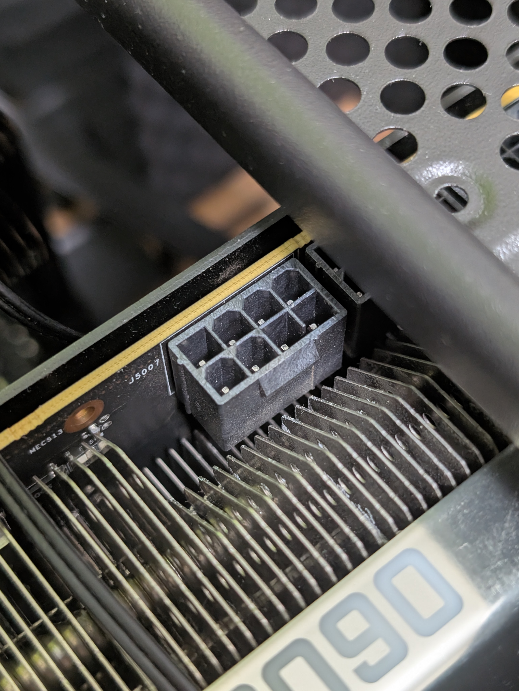{: width="500"}](gpu_fail.jpg)

The GPU barely fit! The physical size wasn't the only challenge – the power requirements for this card are intense, needing multiple power connectors. But the real issue was that even if the card fit in the case, there wasn't enough clearance for the power cables to connect directly.

Rather than modifying the case itself, I found a more elegant solution: 180° power adapters for the GPU power connectors. These U-turn adapters allowed me to connect the power cables without them jutting straight out into the case wall.

[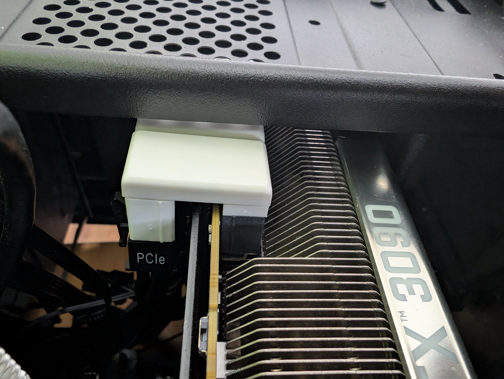{: width="500"}](gpu_win.jpg)

After installing the adapters and some careful cable management, everything fit perfectly. This setup allowed me to maintain the structural integrity of the case while still accommodating this massive GPU.

Here's a close-up of the "surgery" - installing the 180° power adapters that made it all possible. It's a bit tight, but this small solution avoided having to modify or replace the entire case.

[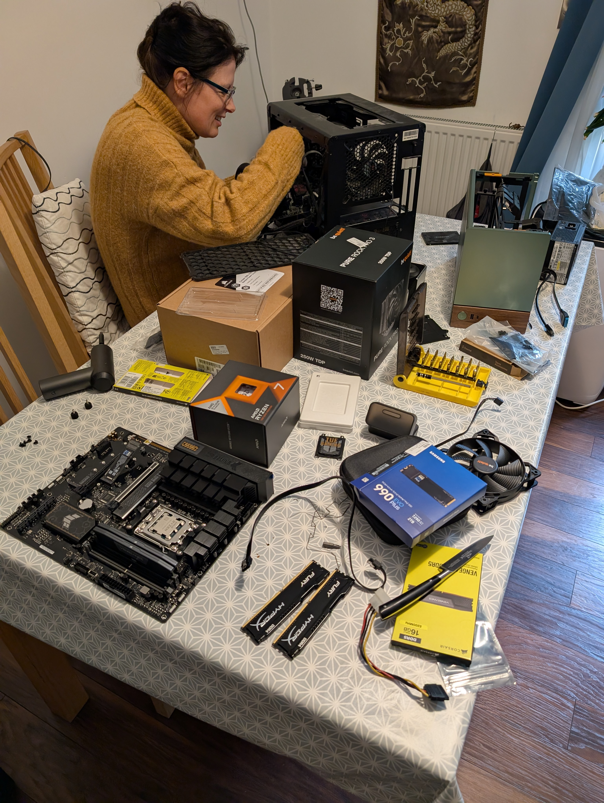{: width="500"}](surgery_build.jpg)

### First Boot

The moment of truth arrived, but it wasn't smooth sailing initially. When I first pressed the power button, the system didn't POST. No display, just fans spinning with no other signs of life.

I went through several diagnostic steps:
1. Reseated the RAM modules
2. Double-checked all CPU fan connections
3. Verified all power cables were properly connected

After these steps, the system finally booted up! But I discovered another issue - the system required a monitor connection to boot properly, which was a problem since this was intended to be a headless server.

Fortunately, I was able to resolve this by entering the BIOS and disabling the monitor connection requirement. This would allow the server to boot without a display attached, which was crucial for my intended use case.

Those first few moments when everything finally works are always the most satisfying part of any build.

# ⚙️ Operating System & Software Stack

[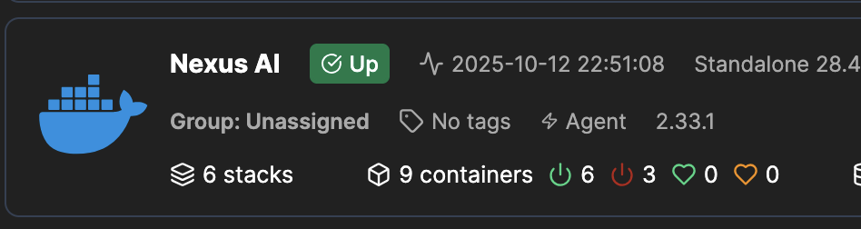{: width="500"}](ai-server-portainer.png)

The system runs a lightweight Linux environment configured for **containerized AI workloads**.

- **OS:** Ubuntu Server 24.04 LTS
- **Virtualization:** Docker + Portainer Agent
- **GPU Drivers:** NVIDIA CUDA Toolkit + `nvidia-container-toolkit`
- **AI Stack:** Ollama, Open WebUI, COmfyUI, n8n
- **Monitoring:** Netdata + `nvidia-smi` + Portainer dashboard

The containerized approach makes managing the entire stack much simpler and allows for easy updates and modifications.

## 🧩 Container Setup

After installing the base Ubuntu Server, the first critical step was installing the NVIDIA drivers natively on the OS. This is absolutely essential before attempting to set up any Docker containers, as the containers need to access the GPU through the host system's drivers.

```bash
sudo apt install nvidia-driver-535
sudo reboot
```

After rebooting and verifying the drivers were working correctly with `nvidia-smi`, I was ready to set up the containerized environment.

I used **Portainer** to manage deployments, starting with a GPU-enabled Docker environment.

Key steps:
1. Installed Docker and NVIDIA runtime
2. Configured permissions for container access
3. Redeployed containers for Ollama and Open WebUI
4. Verified GPU utilization

```bash
docker run --gpus all --rm nvidia/cuda:12.5.0-base nvidia-smi
```

This command confirms that Docker can access the GPU through the NVIDIA container toolkit:

[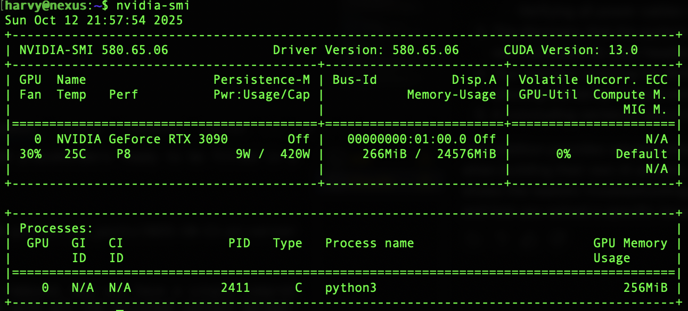{: width="500"}](ai-server-nvidia-smi.png)

Success! GPU is detected and working.

# AI Software Stack

## Ollama Setup

Installing Ollama was surprisingly straightforward. I set everything up using Portainer and Docker Compose for easy management. My docker-compose.yml was simple but effective:

```yaml
version: '3'
services:
  ollama:
    image: ollama/ollama:latest
    container_name: ollama
    restart: unless-stopped
    ports:
      - "11434:11434"
    volumes:
      - ollama:/root/.ollama
    deploy:
      resources:
        reservations:
          devices:
            - driver: nvidia
              count: 1
              capabilities: [gpu]
volumes:
  ollama:
```

With Portainer, deploying this was just a matter of pasting the config and clicking "Deploy Stack". The beauty of containerization is that all the dependencies are handled within the container.

<!-- Placeholder for Ollama running image -->
<!-- [{: width="500"}](ollama_running.png) -->

With Ollama running, I was ready to pull my first model. I decided to start with DeepSeek 7B - a nice balance between capability and resource requirements. I wanted something small enough to quickly test my GPU setup but still powerful enough to be genuinely useful. The command was simple:

```bash
docker exec -it ollama run deepseek:7b
```

Watching the model load up for the first time on my own hardware was surprisingly satisfying. No more API rate limits or usage tracking - just pure local AI power!

## Text Generation WebUI

For the frontend interface, I went with Open WebUI - a sleek, modern interface for interacting with Ollama models. Just like with Ollama, I used Docker Compose and Portainer for deployment:

```yaml
version: '3'
services:
  open-webui:
    image: ghcr.io/open-webui/open-webui:latest
    container_name: open-webui
    restart: unless-stopped
    ports:
      - "3000:8080"
    environment:
      - OLLAMA_API_BASE_URL=http://ollama:11434/api
    volumes:
      - open-webui:/app/backend/data
    depends_on:
      - ollama
    
volumes:
  open-webui:
```

What I love about Open WebUI is how it offers a ChatGPT-like interface but for my local models. The setup was quick, and it automatically discovered my Ollama instance thanks to the container networking.

[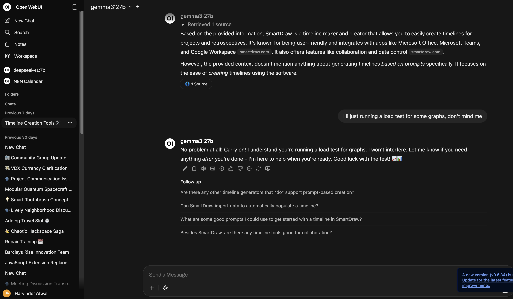{: width="700"}](webui_interface.png)

## Performance Testing

Time to see what this thing can actually do!

### My Model Collection

Over time, I've built up a nice collection of models that balance capabilities with my hardware constraints:

* **DeepSeek-R1 7B** - Great for code generation and technical queries
* **DeepSeek-R1 32B** - My go-to for more complex tasks where quality matters
* **Gemma3 27B** - Google's latest that rivals many larger models
* **GPT-OSS 20B** - An open-source alternative with impressive capabilities
* **Granite3.2 8B** - Newer model with strong reasoning abilities
* **Llama3.2 3B** - Lightweight but surprisingly capable for simple tasks
* **Qwen3 4B** - Another compact model great for routine interactions

[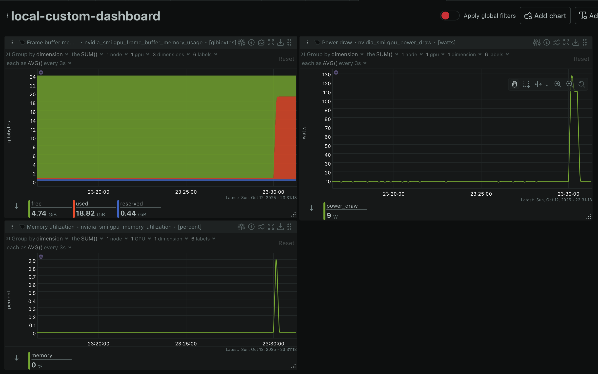{: width="700"}](single-prompt-netdata.png)

### Loading Times

Loading times vary significantly between models, with the larger 27B and 32B models taking noticeably longer than their smaller counterparts. The NVMe SSD helps speed up initial loading, but it's still a good reminder of why I invested in 64GB of RAM - keeping models loaded between sessions makes a huge difference in usability.

### Inference Speed

For real-world performance, I'm getting around 40 tokens per second with Gemma3 27B, which feels incredibly responsive for local inference. The smaller models like Llama3.2 3B and Qwen3 4B run even faster, while the massive DeepSeek-R1 32B is understandably a bit slower but still very usable.

What's impressive is being able to run these models without the latency of API calls - the responses start generating immediately, which makes the interaction feel much more natural than cloud-based alternatives.

# The Reality Check

## Power Consumption

[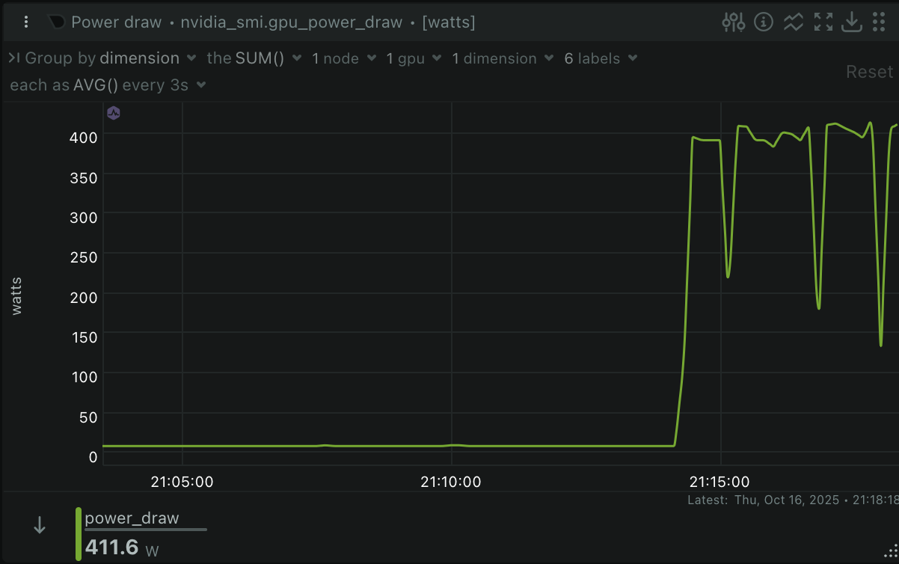{: width="700"}](power_meter.png)

This thing is hungry. According to my Netdata dashboard, the GPU only goes up to 400W under full load when running the larger models. The RTX 3090 is definitely power-hungry, but considering the computational work it's doing, it's impressively efficient compared to running these workloads in the cloud.

I've found that different models have different power profiles. For instance, I'm using Granite specifically for meeting summarization tasks, and it offers a nice balance between power consumption and capability for this specific use case.

## Thermal Performance

[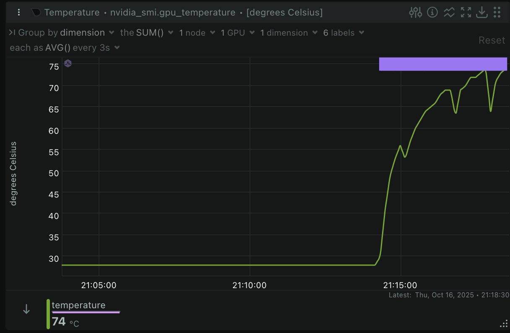{: width="700"}](temps.png)

Looking at the temperature dashboard from Netdata, I'm quite pleased with the thermal performance. The RTX 3090 is maintaining around 70°C under load, which is excellent considering its computational power and idle is under 30.

What's particularly interesting in the graph is how the temperature curves follow the GPU utilization pattern. You can see clear ramp up when running inference on larger modelsor just run a model over time, followed by cooling periods where the temperatures quickly normalize. This indicates the cooling solution is effectively dissipating heat rather than allowing it to accumulate over time.

That said, I'm keeping a close eye on temperatures as I continue to use the system. As it transitions to more constant use with multiple models and simultaneous inference tasks, the thermal profile might change. I'll do a follow-up analysis in a future blog post once I have more long-term data on how the cooling solution performs under sustained workloads.

For now, the BeQuiet Pure Rock Pro 3 seems to be a good match for the CPU's thermal needs, and the 3090's built-in cooling is doing its job admirably well, even in this compact case setup.

## Noise Levels

Noise levels vary dramatically depending on the workload:

- **At idle**: The system is practically silent. The large, slow-spinning fans barely make any noise at all. You could easily sleep in the same room.

- **Text generation**: For standard text prompts and chatting with models, there's a noticeable but gentle increase in fan noise as the GPU wakes up, but it's not distracting - similar to a desktop PC running a moderate workload.

- **Intensive workloads**: When running sustained operations like image generation, video processing, or long transcriptions, the fans do ramp up significantly as the system heats up. During these periods, it can get quite loud - not server-room loud, but definitely noticeable.

If I end up using the server for more sustained workloads regularly, I'll likely need to fine-tune the fan profiles to find a better balance between cooling and noise. For now, the occasional noise during intensive tasks is an acceptable tradeoff for the performance.

# What I've Built So Far

## Personal Assistant Setup

While I haven't built a traditional AI assistant yet, I've been working on something potentially more powerful: an automation system that combines AI with workflow automation. Using Open WebUI for the AI interface and n8n for workflow automation, I'm implementing the Model Context Protocol (MCP) to create connections between my local AI and various services.

My current project is creating workflows that can:
- Read my WhatsApp messages and automatically create Google Calendar events when plans are made
- Summarize long conversations and documents automatically
- Pull information from multiple sources to create consolidated reports

The beauty of this approach is that everything happens locally on my server - no data going to third-party services, complete privacy, and no API costs. It's still early days, but the potential for AI-powered automation that respects privacy is huge.

## Fine-tuning Experiments

I haven't dived into fine-tuning yet, though it's definitely on my radar for future projects. With the hardware I've built, I have the capability to run smaller fine-tuning jobs locally, which opens up some interesting possibilities.

I have several use cases in mind that could benefit from custom-tuned models - some more experimental than others. The beauty of running your own AI infrastructure is the freedom to explore applications that might not be possible or practical with commercial APIs.

This is definitely a topic I'll revisit in a future blog post. The ethical considerations around fine-tuning models for specific purposes is a fascinating area that deserves careful thought and exploration.


# 💡 Lessons Learned

* **Cable management** is trickier than expected with the SHIFT PSU, but worth it.
* **Docker permissions** can block GPU containers if not configured carefully.
* **Thermal management** matters more than peak power — quiet performance beats loud efficiency.
* Running **AI models locally** is liberating — no more API limits or data privacy worries.
* Old ATX cases and really long GPUs don't mix well. The 180° power adapters were a lifesaver
* Don't underestimate power requirements - seriously
* Local AI is incredibly satisfying when it works

Here's a closer look at those 180° power adapters that saved the day:
[{: width="700"}](surgery_build.jpg)

# Cost Analysis

## Hardware vs Cloud

The true cost analysis of this project is something I'm still gathering data for. A comprehensive breakdown will come in a future post where I'll include:

* Detailed hardware costs and component breakdown
* Power consumption measurements for different models and workloads
* Equivalent cloud GPU time costs for similar workloads
* Calculated break-even point considering both hardware and energy costs

Initial impressions suggest the server will pay for itself relatively quickly compared to cloud alternatives, especially for my specific usage patterns. But the real value is in having unlimited access to AI computation without usage limits or privacy concerns.

<!-- Placeholder for cost comparison image -->
<!-- [{: width="500"}](cost_comparison.png) -->

Stay tuned for a detailed cost-benefit analysis in an upcoming post!

# Future Plans

## Hardware Optimizations

* **Memory Offloading**: I've heard it's possible to offload some of the GPU processing to RAM, which could improve performance with these larger models. With 64GB of DDR5, I should have plenty of headroom to experiment with this technique.

* **Cooling Optimization**: If I continue with more sustained workloads, I might need to revisit the cooling solution to maintain lower noise levels while preserving performance.

## Expanded AI Capabilities

* **Image and Video Generation**: I've dabbled a bit with image and video generation, but I want to dive deeper into tools like ComfyUI and Stable Diffusion XL to see what's possible locally.

* **Model Fine-Tuning**: As mentioned earlier, exploring fine-tuning for specific use cases is high on my list. The ethical considerations here will be interesting to explore.

## Integration and Automation

* **Local IDE Integration**: I want to set up an agent-based AI system that can integrate directly with my code editor, providing assistance and suggestions while running entirely locally.

* **Personal Automation**: Taking the MCP integrations further to automate routine tasks like administrative work, generating initial responses to emails or messages, and handling scheduling.

* **Agent Experiments**: The field of agentAI is fascinating - giving models more autonomy to perform complex, multi-step tasks. I want to explore building specialized agents for different domains of my work.

# Final Thoughts

If there's one lesson I learned from this build, it's **Rule #1: Don't buy parts late at night.** Make sure you've done thorough research before clicking "purchase" - I'm looking at you, SHIFT PSU and wrong-size motherboard.

Was the investment worth it? I'd say definitely yes. I've always followed the philosophy of buying more compute than you think you need, because you'll quickly push to the limits of whatever you have. I've seen too many people try to save money on graphics cards only to later complain about compatibility issues or performance bottlenecks because they didn't go with more mainstream or properly benchmarked GPU models.

That said, I'm still calculating the total cost-effectiveness compared to cloud options. Once I work out the running costs over time, I'll have a clearer picture of the economics. There's also the comparison to consider with running models online manually or in a VM - different approaches with different trade-offs.

The unexpected benefit has been the learning experience. Understanding how these models and the surrounding software ecosystem works has been invaluable, and the ability to tweak parameters and experiment freely has deepened my knowledge significantly. 

Perhaps the most compelling advantage is privacy. Using MCP to connect these powerful AI capabilities to my private notes, messages, and personal data without sending anything to third-party services has enormous potential if set up correctly.

The best part? No more waiting for cloud GPU availability or watching costs rack up. Everything runs locally, and I can experiment freely.

Would I do it again? Absolutely - but with a bit more research on component compatibility before ordering. The frustrations of the build process fade quickly, but the capabilities of having this much AI power at my fingertips will continue to provide value for years to come.

---

*If you're thinking about building your own AI server, feel free to reach out. Happy to share more details about the build process or help troubleshoot similar setups.*