# 🍻 Why I Built This

[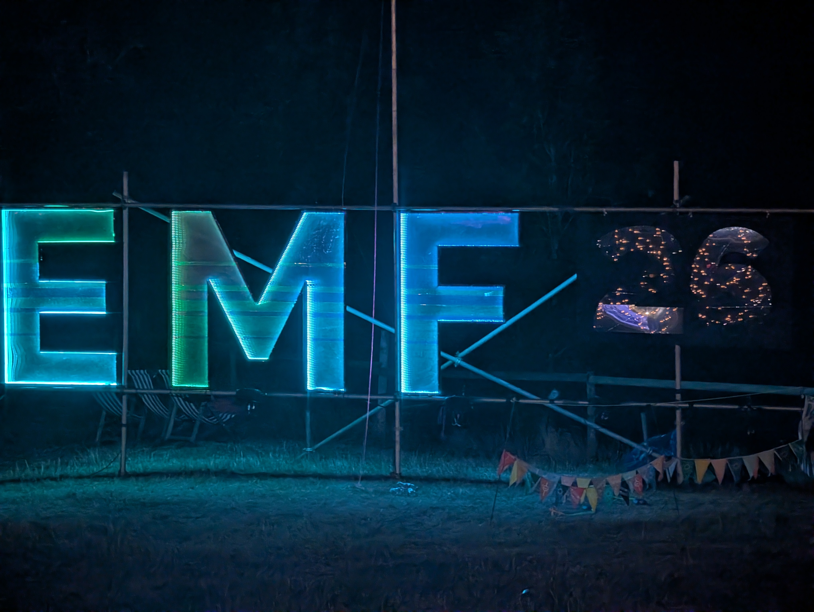{: width="700"}](Big_EMF_Sign_at_nighttime.jpg)

Quick primer if you don't know what EMF Festival is: it's a UK camping festival for hackers, makers and general nerds, held every couple of years at Eastnor Castle Deer Park out in Herefordshire. Think fields, tents, a few thousand people, some genuinely brilliant talks and art installations, and a lot of soldering irons.

<video src="EMF_overhead_shot.mp4" width="700" controls muted playsinline></video>

That's the whole site from above: main stage, the lake, and a field absolutely rammed with tents. Exactly the kind of environment where "let's track everyone's drinks on a public dashboard" sounds like a completely reasonable idea at 11pm.

So that's what I did. Four of us went this year: ash, cha, hvy (me) and tin, and I talked everyone into logging drinks, toilet trips, steps, mood, and even bank spending through the festival, all going into a serverless AWS backend I'd built. Either that says something nice about our friendship, or something concerning about my powers of persuasion.

The project is called open-emfer-v2: Python on Lambda, one DynamoDB table, a plain HTML dashboard on S3, Terraform doing the deploys on every push to main. Every action got written as an immutable event as well as updating a "current totals" cache for the live dashboard. That distinction matters later, because the cache lied to us more than once.

The "v2" isn't just a naming affectation, either. There was a real v1, built back at EMF Camp 2024. Same rough idea (Lambda + DynamoDB backend, beer/toilet/location/status tracking, and a working Monzo API integration polling every 30 minutes), but the dashboard back then was a Grafana Cloud board rather than a custom site, and statuses were shown as Fallout Pip-Boy icons, which I stand by as a good decision. The 2024 README had a running todo list. Two items on it never got ticked off in two years: "Test browan sensor" and "Revisit map." Keep that in mind for the GPS and sensor issues below. 

EMF proper starts on the Thursday, so that's where the day-by-day numbers below pick up.

## Table of Contents
- [How It Worked](#how-it-worked)
- [The Drinks](#the-drinks)
- [The Steps](#the-steps)
- [The Toilet Log](#the-toilet-log)
- [Mood of the Camp](#mood-of-the-camp)
- [Festival Pace](#festival-pace)
- [Did the Weather Have Anything to Do With It?](#did-the-weather-have-anything-to-do-with-it)
- [Turns Out People Were Watching](#turns-out-people-were-watching)
- [Other Hardware Sensors](#other-hardware-sensors)
- [Lessons Learned](#-lessons-learned)
- [What's Next for V3](#whats-next-for-v3)
- [Final Thoughts](#final-thoughts)
- [Get the Raw Data](#get-the-raw-data)

# How It Worked

Nothing fancy architecturally, just a lot of small pieces:

- **Lambda + API Gateway** for the API
- **DynamoDB**, single table, everything from raw events to cached leaderboards living in the same place
- Every drink/toilet/status/step/lecture logged as its own timestamped event, never deleted
- A separate cached "totals" record per person, updated alongside each event, which is what the live dashboard actually reads from
- Terraform + GitHub Actions redeploying on every push to main

I only really pulled the raw data out of DynamoDB properly after the festival, to write this post. Good thing I did, because it turns out the cache and the raw log didn't always agree with each other, and untangling that turned into most of the actual work here.

Everyone got a personal QR code printed onto a t-shirt, linking straight to their own public dashboard page, so anyone at camp could scan your back and see how many drinks you were on:

[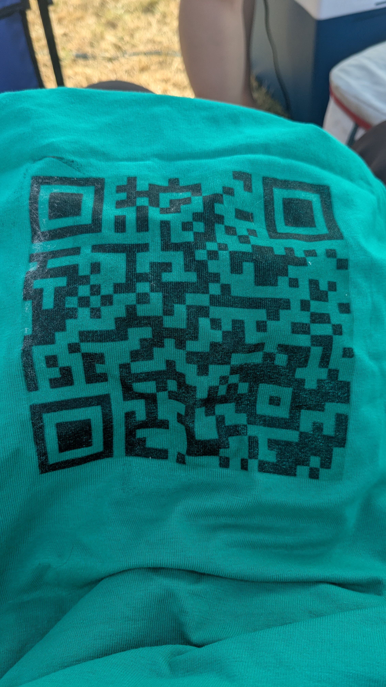{: width="400"}](QR_code_on_tshirt.jpg)

Genuinely one of the better ideas in this whole project, and a good chunk of that walking-billboard effect probably explains the Ledbury visitors later on. Logging itself still happened separately, through the admin portal on your own phone.

Here's what scanning one actually landed you on:

[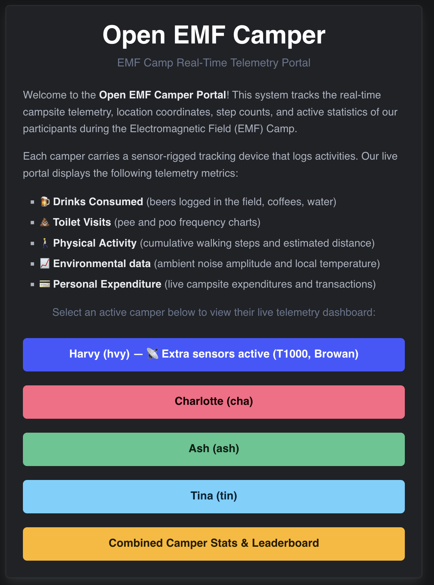{: width="500"}](public_dashboard_landing_page.png)

Worth zooming in on my own button there: "Extra sensors active (T1000, Browan)." I never got them to work.

Clicking through gets you an individual dashboard:

[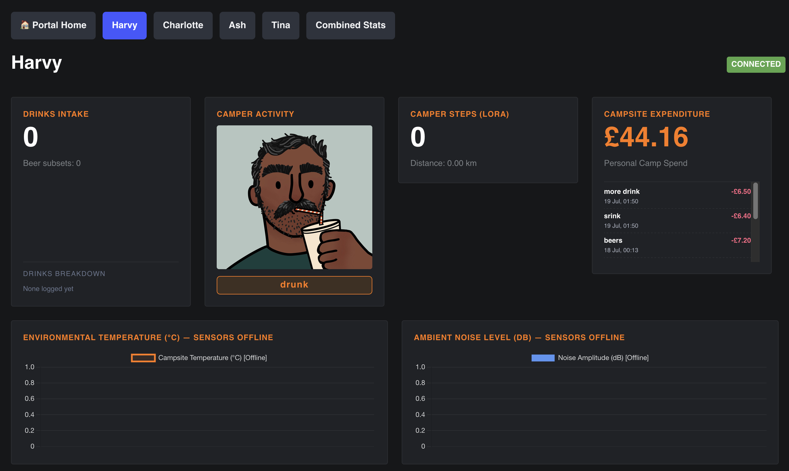{: width="700"}](public_dashbaord_profile.png)

That's mine, mid-reset (drinks and steps both showing 0 for the day), status set to "drunk," maybe I was when waking up in the morning. Sensors politely reporting themselves offline, and the spend log underneath with "srink" sitting there as a typo that have been more related to the time it was recorded.

# The Drinks

126 drinks logged across the four of us over the week:

[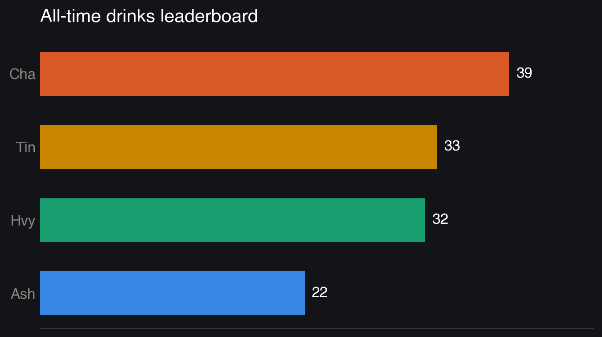{: width="600"}](chart_1_drinks_leaderboard.png)

And here's the actual live leaderboard, straight off the dashboard, matching:

[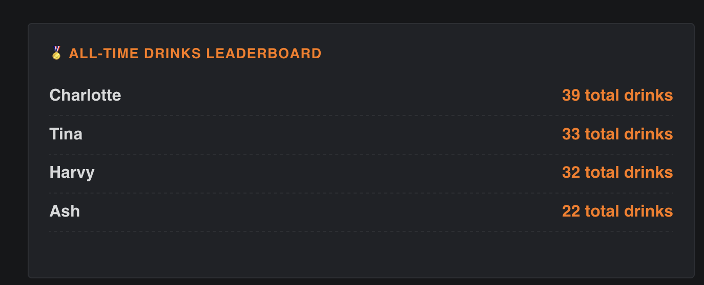{: width="600"}](alltime_drinks_dashboard.png)

Cha wins with 39. Tin and I are basically tied behind on 33 and 32. Ash comes in a fairly restrained 22. No way to tell if that's good pacing or bad logging.

Splitting it out by what people actually drank, reconstructed from the raw event log rather than the (broken, see below) cached totals:

[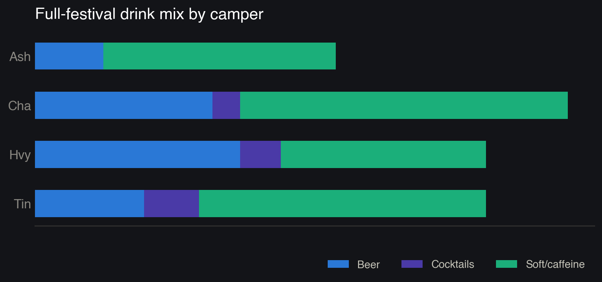{: width="700"}](chart_3_drink_teams.png)

Mostly soft drinks and coffee, some beer, a little bit of cocktail chaos. The full list of things logged includes Lager, Cider, BoxWine, BoxPerry, Martini, Negroni, Port, G+T, ClubMate, Coffee, Tea, Water. Negroni. That was me. No regrets. I was spending almost every day updating the drinks list.

# The Steps

Right, this section took a rewrite. My first pass through this data had us walking a suspiciously round 138,407 steps between us, and something about Tin's chart jumping from 6,640 one day to 47,433 the next made me go back and check the raw numbers rather than trust the app's own cached totals.

Friday lunchtime, I tried to get clever and auto-detect whether a manually typed-in step number was meant as "today's total" or "steps since forever." Exactly the kind of thing that sounds smart at a festival and is not. By Saturday I'd apparently given up on being clever and gone the other way entirely: just store the cumulative number in the daily slot. Obviously wrong too, and it's the one that produced Tin's day going from 6,640 to 47,433 overnight.

The actual fix didn't land until Saturday evening: strictly treat whatever gets entered as today's daily total, mirroring how a smartwatch displays it, and work out the cumulative total separately by adding it to yesterday's baseline. Good fix. Way too late. By the time it shipped, Thursday through most of Saturday had already been logged under whichever interpretation happened to be live at the time. Sunday's numbers for Cha and Tin still don't line up with the raw sync events either. My best guess is a one-off historical rebuild I ran later that day re-derived those two days with the same flawed assumption, though I can't fully prove that from the data.

This is where event sourcing architecture saved my bacon, as it recorded every event I knew I could re-calculate it how I wanted later. 

That's basically how the whole steps saga went. Fix one thing, another one pops up somewhere else. Practically every fix that week was patching a hole the previous fix had just opened.

Either way, I didn't trust any of it, and rebuilt each day's real step count straight from the raw sync events instead:

[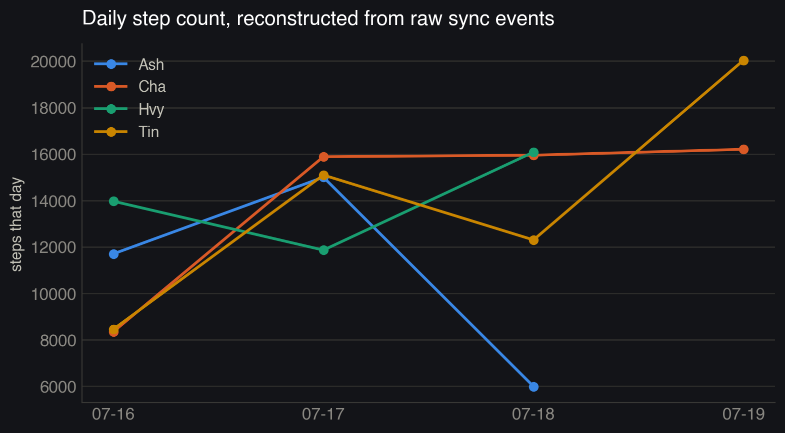{: width="700"}](chart_2_steps_trend.png)

With that fix, the real total across camp is **186,865 steps**, or about **118 km** collectively (still worked out from steps × stride length, not GPS, more on that below). Cha and Tin come out well ahead of Ash and me across the week. Ash's line dropping off after the 18th is presumably a phone that stopped syncing, rather than someone camping in one spot for two days straight.

# The Toilet Log

We tracked this too, for reasons I no longer fully remember. 59 visits total, 43 pees and 16 poos:

[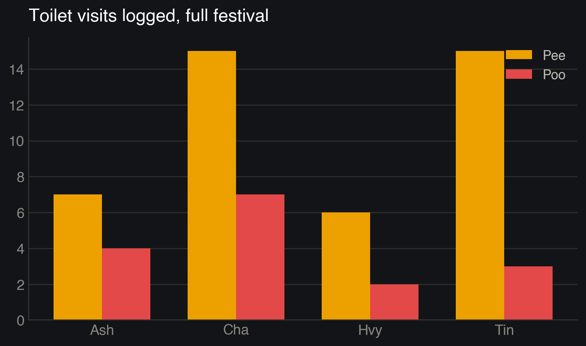{: width="600"}](chart_4_toilet_visits.png)

Cha leads here as well, which at least makes the drinks leaderboard internally consistent.

# Mood of the Camp

Everyone could set a status at any point: Chilling, Drinking, Drunk, Lecture, Sleeping, Tired, Roaming, Eating, Workshop, Coding, and so on. Turning the status changes into rough durations:

[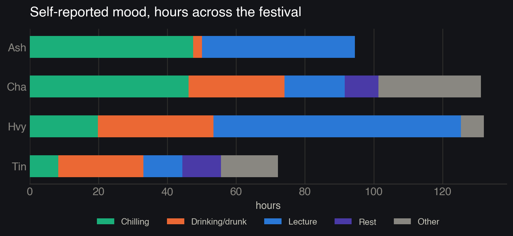{: width="700"}](chart_5_mood_breakdown.png)

Big caveat here: we're human, and humans forget to press buttons. If someone forgot to switch out of "Lecture" after leaving a talk, that time just keeps accumulating against Lecture until the next status change, so treat these numbers as "roughly how people spent their time" rather than anything precise. My own 72 hours of reported Lecture time in particular is almost certainly inflated by exactly this.

Also worth flagging: there were two separate ways to track time in lectures running at once. A dedicated Start/Stop timer (only Tin and I used it, 3h45m and 1h52m) and this self-reported status (which Ash and Cha used instead, 44h and 17h). Neither is more "correct" than the other. They're just measuring different things badly in different ways.

# Festival Pace

All events, all types, by day, starting Thursday, when the festival actually started:

[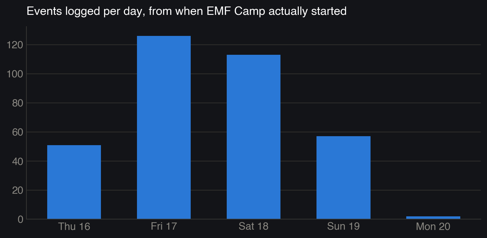{: width="700"}](chart_6_daily_pace.png)

Friday and Saturday are clearly peak camp, tailing off through Sunday, and Monday's two lonely events are just someone remembering to log something on the drive home.

# Did the Weather Have Anything to Do With It?

Eastnor was hot and dry all week. Pulled the actual historical weather for the site (from Open-Meteo) out of curiosity:

| Day | Max temp | Rain | Drinks logged | Toilet visits |
|---|---|---|---|---|
| Thu 16 | 26.9°C | 0mm | 19 | 6 |
| Fri 17 | 27.8°C | 0mm | 44 | 16 |
| Sat 18 | 22.8°C | 1.1mm | 41 | 20 |
| Sun 19 | 23.1°C | 0mm | 22 | 16 |

I went in expecting "hotter = more drinking, more toilet trips" and the data just... doesn't say that. Friday's the hottest day and also the busiest, sure, but Saturday's noticeably cooler and slightly rainy, and toilet visits actually peak there. With four days of data this is really just four numbers, not a trend. Friday and Saturday being peak days is much more obviously explained by "that's just when the festival was busiest" than by the weather. I looked. Nothing solid here. Moving on.

# Turns Out People Were Watching

The dashboard was public and I'd bolted Google Analytics onto it almost as an afterthought. Checking it after the fact for the festival week: **45 unique visitors across 6 countries**, which is a lot more than the four of us wearing trackers.

Breaking that 45 down by day tells its own story:

[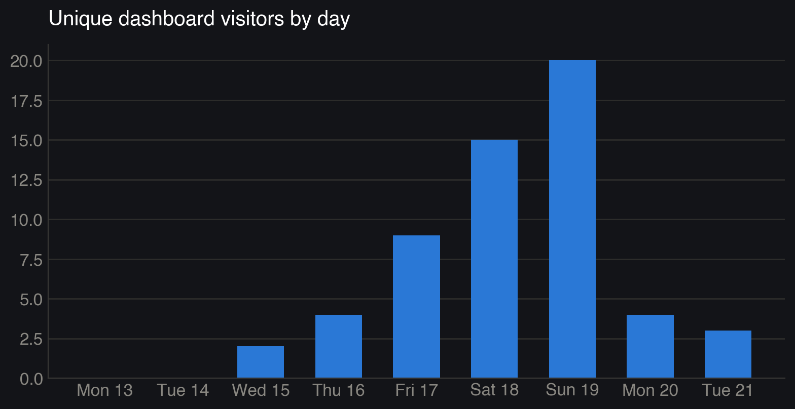{: width="700"}](chart_7_ga_visitors_by_day.png)

Interesting that this one peaks Sunday, the day before we packed up and went home, rather than Friday or Saturday like everything else in this post. Maybe people were catching up on the leaderboard before it disappeared.

A few other things stood out digging into it:
- 305 page views from 83 sessions. Works out to roughly 3-4 views per session, which for what's basically a single page probably means people were refreshing or flicking between the dashboard and admin views rather than genuinely browsing multiple pages.
- Average engagement time was only about 55 seconds per visitor. Reads as a "quick glance at the leaderboard, close tab" pattern rather than anyone sitting and watching it live, which tracks for something you'd check between beers.
- Overwhelmingly mobile: 37 mobile active users vs 8 desktop, mostly Android and iOS. Nobody's opening a laptop at a campsite.

# Other Hardware Sensors

There were two bits of other hardware, both from v1 originally and carried over into v2. A Seeed SenseCAP T1000, which is a small GPS tracker that also reports air temperature, ambient light, and its own battery level. And a Browan TBSL100, a sound-level sensor that reports internal temperature, decibels, and battery. Neither has wifi or a SIM card. They both talk over LoRa, a long-range, low-power radio protocol built for exactly this kind of "small packet, long range, tiny battery" use case.

Here's the part that matters. A LoRa device doesn't talk to the internet directly. It broadcasts a radio packet, and that packet only becomes useful if a LoRaWAN gateway happens to be listening nearby, picks it up, and forwards it on to a network server (in this case, one called ChirpStack) which then hands it off as a plain HTTP request to whatever webhook you've configured, in my case an API Gateway endpoint feeding a Lambda that writes it into DynamoDB. That whole chain, from the sensor in your pocket to a number showing up on the dashboard, depends entirely on step one: some gateway, owned by someone else, being switched on, in range, and correctly configured to forward to my endpoint.

v1 actually had this working, riding on someone else's community-run gateway near the site. v2 just never got that side of things set back up. No gateway registered, nothing configured to receive it, so the sensors were dead from day one this time, not because anything failed mid-festival.

That's the wider problem with LoRa hardware for something like this. Even when it works, you're buying and pairing physical devices, registering them with a network server, keeping batteries charged, and then hoping someone else's gateway happens to be switched on and in range, because you don't own that part of the chain yourself. That's a lot of infrastructure to maintain across two versions of a project for a temperature and a decibel reading.

Which is really the same lesson as the steps and GPS one, just for weather instead of movement. I already proved during the write-up that ambient conditions for the site are just sitting in a free public weather API, no hardware required (see the weather section above). If the goal is "what was the weather actually like at camp," that's solved. The only thing bespoke hardware would still uniquely give you is something hyper-local, like the actual decibel level three feet from a specific tent, and it's worth being honest about whether that's worth chasing versus just pulling the data that already exists.

# 💡 Lessons Learned

Going through this properly meant going through my own commit history mid-write, which was humbling. In rough order of how much they actually mattered:

- **The steps saga** (detailed above). This one actually changed the numbers in this post, not just the story around them.
- **The GPS trail map.** I built it, then restricted it to my own dashboard, and it never got real coordinates anyway. Two years later, still "Revisit map" from the v1 todo list.
- **The environmental sensors.** The honest fix here was just hiding the temperature/noise widgets rather than showing stale numbers when the sensors were offline, root cause being the LoRa gateway setup never getting carried over from v1, covered above. "Test browan sensor" is still unticked since 2024.
- **The all-time drink category breakdown has no fix at all.** It resets with the daily aggregate. I knew about it in the field and meant to patch the data afterwards.
- **The spend migration.** Replaced the Monzo integration that never got built with manual entry. Only Tin and I used it, so Ash and Cha's numbers are missing, not zero.

# What's Next for V3

The biggest single realisation writing this post: I spent two versions of this project building and trying to use the custom sensor hardware (LoRa GPS trackers, Sensecap and Browan environmental sensors), none of which ever really worked, while all four of us were wearing a smartwatch that already does steps, GPS, and heart rate properly. The real v3 idea isn't "fix the custom hardware." It's "stop building custom hardware and pull data from what people already have on their wrist": Apple Health, Garmin Connect, Google Fit, whatever. Someone else has already solved GPS and step counting far better than I ever will with a LoRa module and a prayer.

With that as the theme, the rest falls out fairly directly:

- **Ingest steps and GPS from people's own watches** instead of manual entry or bespoke trackers. Kills the steps interpretation bug and the dead GPS map in one move, since it's just reading a number a watch already computed correctly.
- **Real Monzo or other Open Banking integration**, properly this time. v1 had it working, v2 didn't get there. It's gonna be hard but useful.
- **One lecture-time mechanism**, not two disagreeing ones and can I automate it with location information.
- **All-time drink category breakdown as a first-class stored field**, not something I have to rebuild from the event log by hand after the fact.
- **Decide, properly, whether the custom environmental sensors are worth it at all.** A free public weather API already covers "what was it like at camp" (see above). The only thing bespoke hardware still buys you is hyper-local readings, which might just not be worth chasing.
- **If they are worth it, bring my own LoRaWAN gateway.** v1 rode on someone else's community gateway, v2 never set one up at all. Owning that one box myself, on-site, means it's actually in my control rather than a dependency I forget to configure.
- **Make the QR codes two-way.** Right now scanning someone's shirt only takes you to their dashboard. Could just as easily let a scan leave a comment, or pose a quick question back ("how's Cha's day going?") and log the answer against them. Same QR code, same no-app-needed flow, just richer than a read-only page.
- **Actually build this as an app**, not a website you have to remember to open. Gets you real phone sensors and push notifications for free. Two obvious uses: prompt people to log data at regular intervals instead of relying on anyone remembering to, and use location/geofencing to detect when someone's actually sitting in a talk tent and time lecture attendance automatically. That last one alone would kill the whole "two disagreeing lecture trackers" problem from above. No button to forget to press if the app just knows you're in the tent.
- **A dedicated physical terminal for logging.** An ESP32 with a big physical button on the table, wired straight into the API, no phone required. Press it once, drink counter goes up. Genuinely might get more consistent logging out of a drunk friend than any app ever would.

# Final Thoughts

Would I do this again? Maybe. There's something very funny about turning four friends at a festival into a distributed systems project, and even funnier that someone in Panama apparently cared enough to check in on our toilet habits. (Probably someone at EMF on a VPN)

At the same time could just do something completely different, I guess the real motivation is to get more and more data which then starts to get analysed. 

Event sourcing was the one architectural decision that actually paid for itself here. Every wrong number the live dashboard ever showed turned out to be recoverable from the raw log. That's exactly the property you want from something running unattended on campsite wifi for a week while you're mostly just trying to have a good time.

---

*If you were one of the mystery visitors from Panama, Switzerland, or Germany, genuinely, get in touch. I'm curious.*

# Get the Raw Data

The cleaned event log behind every chart in this post is [available here](emf-camp-2026-raw-data.json) (JSON, ~145KB): exactly what came out of the DynamoDB scan. Per-user telemetry events, cached aggregates, device state, and the manually-logged spend records.
