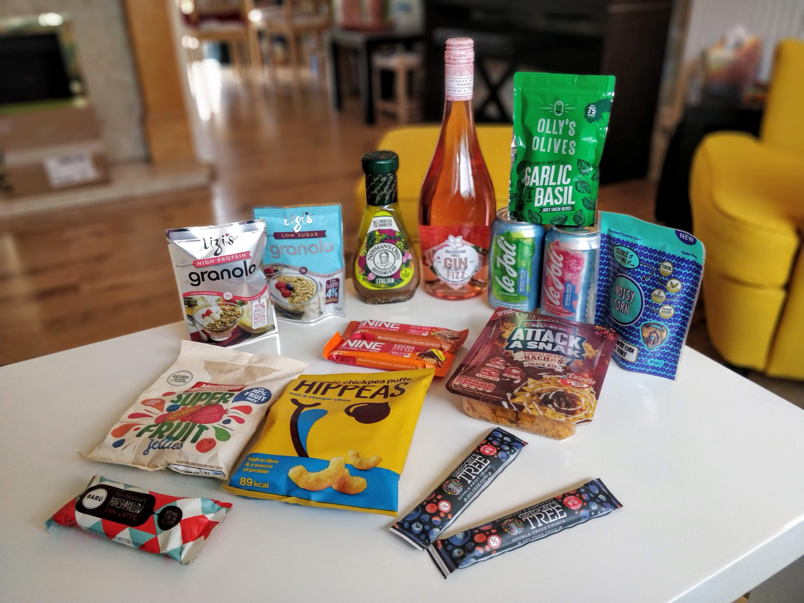

The June Box arrived and was looking good at first sight. 

Tina
-----
The big bottle of Gin Fizz was dominating in the box, just a shame it was pink. Nevertheless, looking forward to taste it, after cooling it of course. 

There were also several snack items, which waited for that afternoon motivation plunge to be devoured - Chickpea puffs, fruit jellies, rosted corn and sweet cereal and marshmellow bars. There was also another bottle of salad dressing, which - together with the two from last month - mean, we better start eating salads. We will have to fight the slugs in the veg-bed more rigorously. 

Harvy
----
A few things have cought my eye but there's also a few that I'm not bothered about (yet another salad dressing).

There's "Attack a Snak" which reminds me of lunchables, they were a desperation food but would probably have it again, so intertested to see how these turn out.
I'm looking forward to Baru (?) because who doesn't like chocolate marshmellow in a bar. Noisy snacks looks intreguiing, they boast they use double the flavouring of other snacks. Is that a good thing?

##### Superfruit Jellies
Overwhelming smell to the point of artificial. The choice of flavours was :shaky hands but not trump: It just seemed to break up in your mouth but not really melt.

#### Baru Chocolate Marshmallow Bar
Looks like expected for a Marshmellow chocolate bar, nice and soft. A little too sweet for the generous size, but marshmellow lovers will probably like it. It was supposed to be Chai Latte flavour, but there wasn't much of it, which I actually preferred. 
